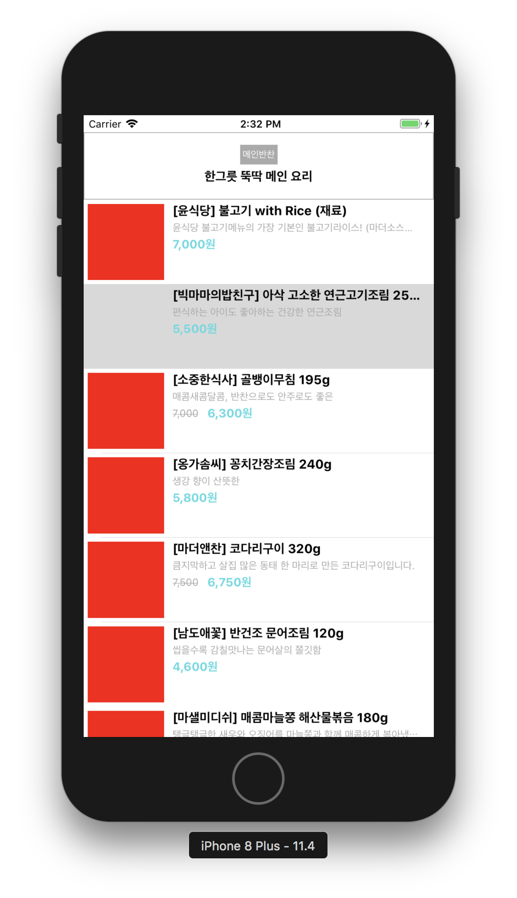
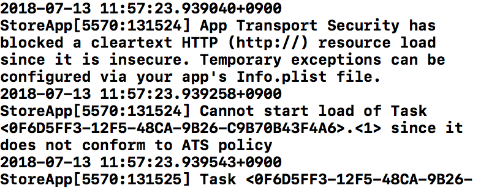
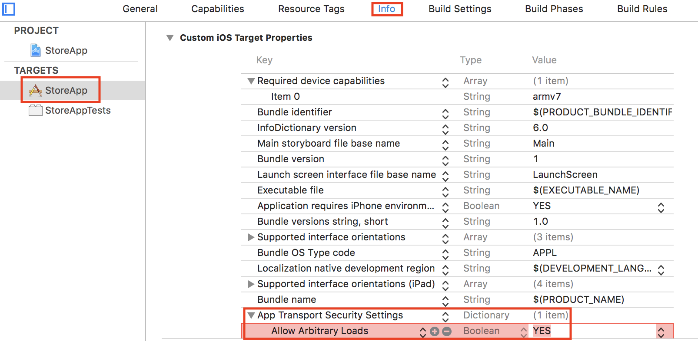

= Store

=== 1. 시작하기, 2. Auto Layout 적용

===== 실행결과

image:./images/result-2-1.png[45%, 45%]
image:./images/result-2-2.png[45%, 45%]
image:./images/result-2-3.png[45%, 45%]
image:./images/result-2-4.png[45%, 45%]

===== 학습거리 
* https://developer.apple.com/documentation/foundation/archives_and_serialization/encoding_and_decoding_custom_types[JSON Encoding/Decoding]
* https://developer.apple.com/sample-code/xcode/downloads/Auto-Layout-Cookbook.zip[Auto Layout Sample Code]
* https://github.com/yuaming/wiki/blob/master/ios/auto-layout.adoc[Auto Layouot 정리]
* https://github.com/yuaming/wiki/blob/master/ios/high-performance-auto-layout.adoc[High Performance Auto Layout 정리]
* https://github.com/yuaming/wiki/blob/master/ios/how-to-adjust-automatic-row-height-in-table-view.adoc[TableView 동적으로 높이 조절하기 정리]

=== 3. Custom Header 적용

===== 실행결과

image:./images/result-3-1.png[45%, 45%]

=== 4. CocoaPods 관리

===== 실행결과 

image:./images/result-4-1.png[45%, 45%]

===== 학습거리
* https://developer.apple.com/library/archive/featuredarticles/XcodeConcepts/Concept-Targets.html#//apple_ref/doc/uid/TP40009328-CH4-SW1[Xcode Concepts]
** 요약
*** Workspace
**** 하나 이상 프로젝트가 포함되어 있음
**** 하나 Workspace에서 여러 프로젝트가 존재할 수 있음
*** Project 
**** App을 구성하는 모든 파일, 리소스, 정보가 포함되어 있음
*** Target 
**** 프로젝트 빌드 설정 정의함
**** 같은 프로젝트에서 서로 다른 배포판을 관리하기 위해 사용함. 예를 들어 회사 전용, 일반 전용으로 배포판을 나눌 수도 있고 배포 설정을 다르게 해서 사용할 수 있음
**** 하나 프로젝트 안에 Target이 여러 개 있을 수도 있음
*** Scheme 
**** Build, Test, Profile 등을 수행할 때 어떤 동작을 할지 정의함
**** An Xcode scheme defines a collection of targets to build, a configuration to use when building, and a collection of tests to execute
** *_Workspace 안에 Project A, B가 있고 정해놓은 Scheme에 따라 Target 범위가 설정됨_*

=== 5. Networking Programming

===== 실행결과

===== 학습거리 
* 에러 발생
** http 통신이 되지 않아 해결책을 찾음
** `App Transport Security`
** http://blowmj.tistory.com/entry/iOS-iOS9-App-Transport-Security-설정법[App Transport Security 설정법]

> App Transport Security(이후 ATS)는 iOS 9.0또는 OS X 10.11 이상 유효하며, 응용프로그램과 웹 서비스간의 안전한 연결을 위해 사용할 수 있음. ATS가 활성화되면 HTTP를 통해 통신을 할 수 없음. 또한 Apple에서 권장하는 요구 사항을 충족하지 않는 연결은 강제로 연결 실패 처리됩니다. 예를 들어, Apple 권장 요구 사항을 충족하지 않는 Web 페이지를 WKWebView 에서 열려고 하면 페이지로드는 실패함

* URLSession, Alamofire
** https://developer.apple.com/documentation/foundation/url_loading_system[URL Loading System]: Apple에서 지원하는 네트워크 관련 프레임워크
** https://github.com/Alamofire/Alamofire[Alamofire]: Apple에서 지원하는 네트워크 관련 프레임워크를 추상화한 Wrapper
** Alamofire를 사용하면 Wrapper 이기 때문에 코드는 깔끔해지지만 라이브러리 의존성이 생기기 때문에 메인테이너가 업데이트 지원하지 않을 때 문제가 발생함
** Alamofire를 URLSession 원리를 모른 채 사용하면 네트워크 문제가 발생할 때 해결하기 힘듦

* http://kka7.tistory.com/84[읽을거리: iOS 개발자도 잘 모르는 가장 일반적인 실수 10가지]