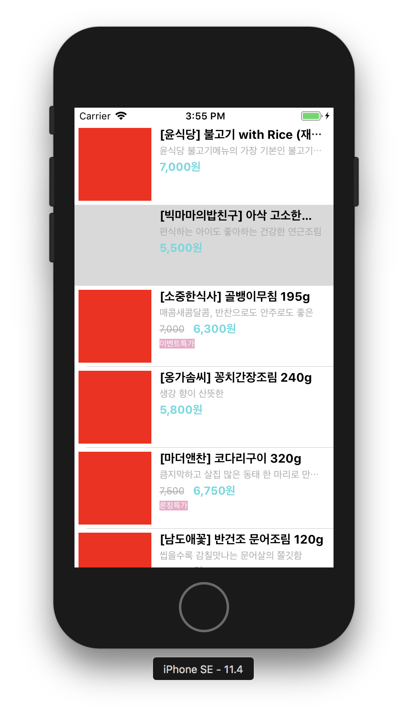
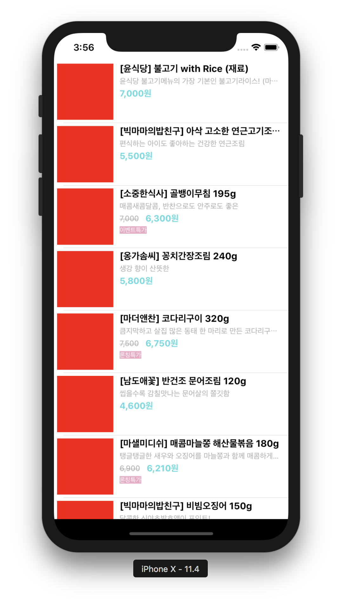
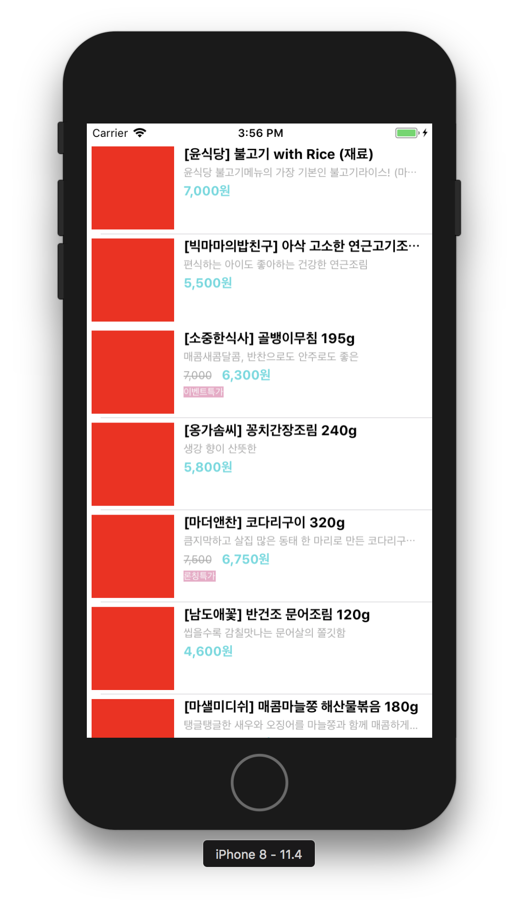
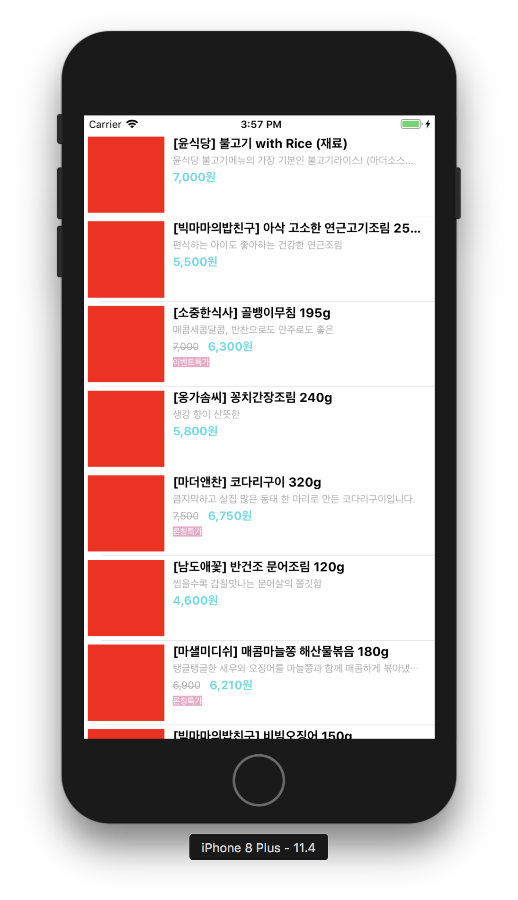
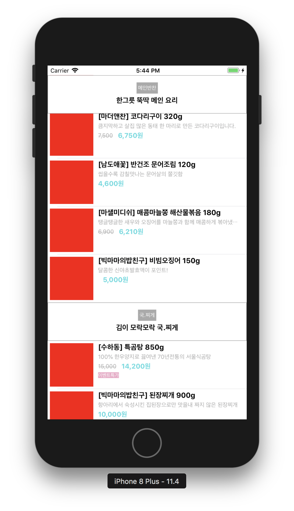
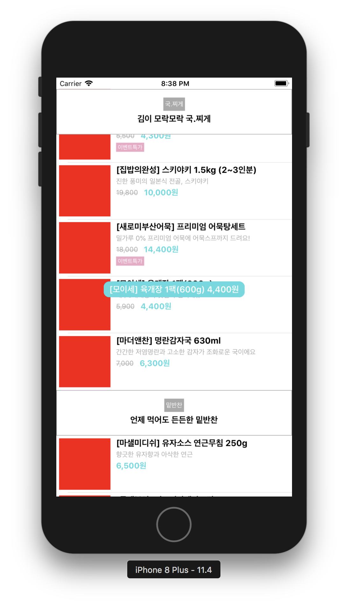

= Store

=== 1. 시작하기, 2. Auto Layout 적용

===== 실행결과

===== 학습거리 
* https://developer.apple.com/documentation/foundation/archives_and_serialization/encoding_and_decoding_custom_types[JSON Encoding/Decoding]
* https://developer.apple.com/sample-code/xcode/downloads/Auto-Layout-Cookbook.zip[Auto Layout Sample Code]
* https://github.com/yuaming/wiki/blob/master/ios/auto-layout.adoc[Auto Layouot 정리]
* https://github.com/yuaming/wiki/blob/master/ios/high-performance-auto-layout.adoc[High Performance Auto Layout 정리]
* https://github.com/yuaming/wiki/blob/master/ios/how-to-adjust-automatic-row-height-in-table-view.adoc[TableView 동적으로 높이 조절하기 정리]

=== 3. Custom Header 적용

===== 실행결과

=== 4. CocoaPods 관리

===== 실행결과 

===== 학습거리
* https://developer.apple.com/library/archive/featuredarticles/XcodeConcepts/Concept-Targets.html#//apple_ref/doc/uid/TP40009328-CH4-SW1[Xcode Concepts]
** 요약
*** Workspace
**** 하나 이상 프로젝트가 포함되어 있음
**** 하나 Workspace에서 여러 프로젝트가 존재할 수 있음
*** Project 
**** App을 구성하는 모든 파일, 리소스, 정보가 포함되어 있음
*** Target 
**** 프로젝트 빌드 설정 정의함
**** 같은 프로젝트에서 서로 다른 배포판을 관리하기 위해 사용함. 예를 들어 회사 전용, 일반 전용으로 배포판을 나눌 수도 있고 배포 설정을 다르게 해서 사용할 수 있음
**** 하나 프로젝트 안에 Target이 여러 개 있을 수도 있음
*** Scheme 
**** Build, Test, Profile 등을 수행할 때 어떤 동작을 할지 정의함
**** An Xcode scheme defines a collection of targets to build, a configuration to use when building, and a collection of tests to execute
** *_Workspace 안에 Project A, B가 있고 정해놓은 Scheme에 따라 Target 범위가 설정됨_*
