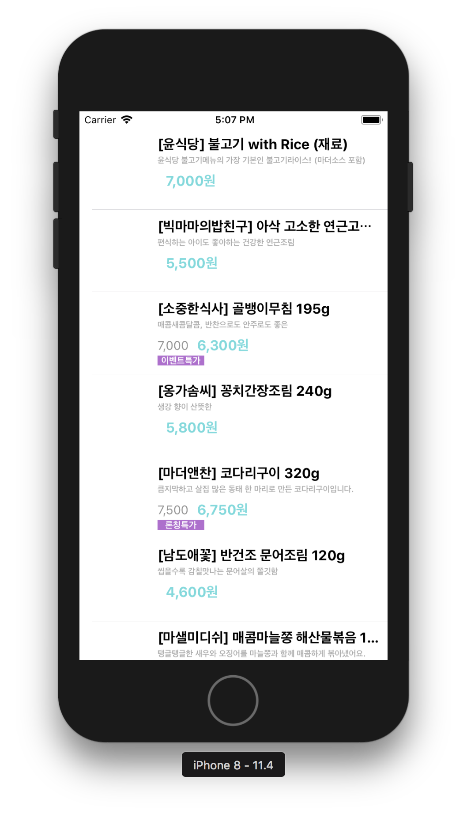
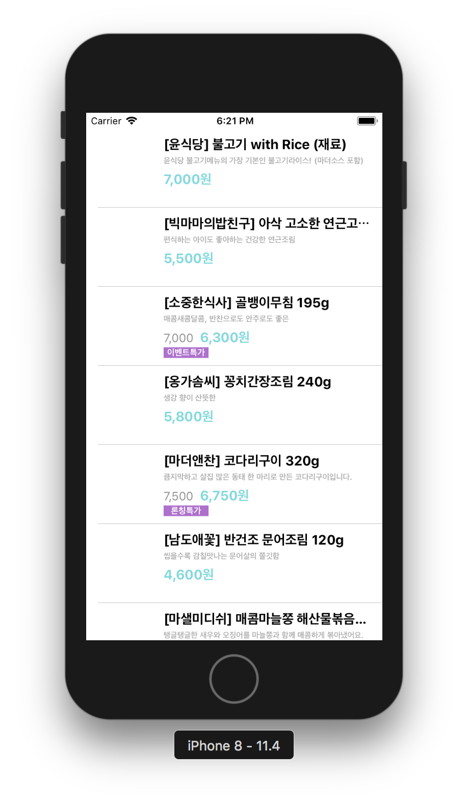
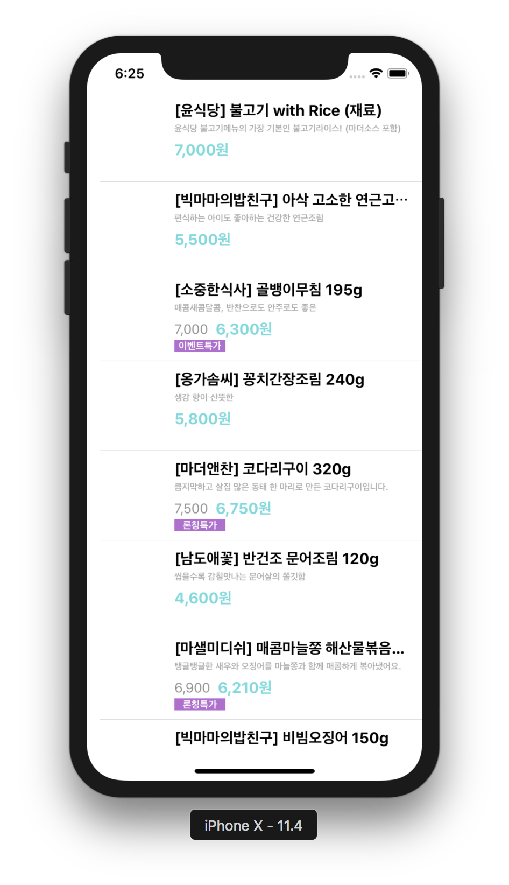
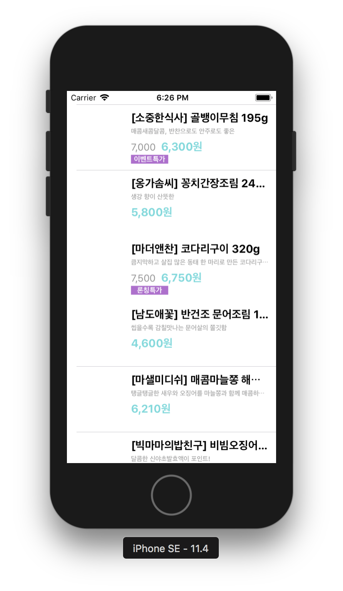
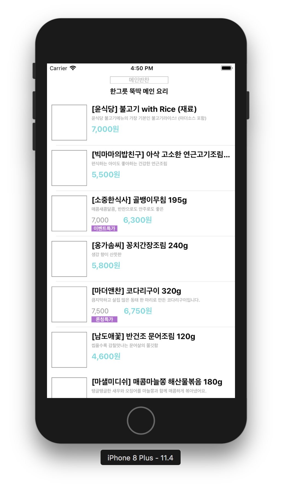
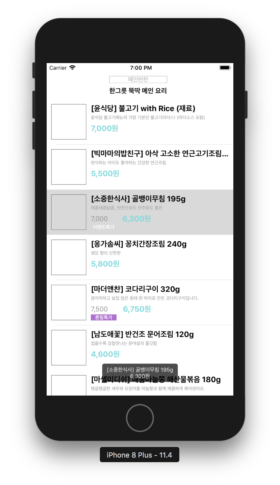
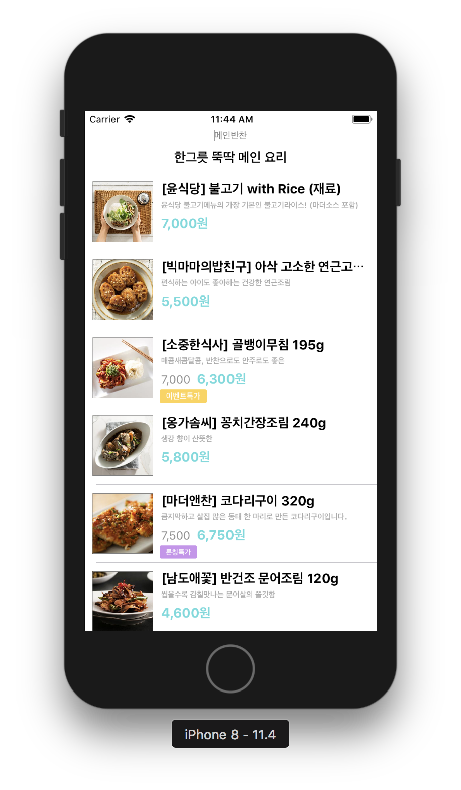
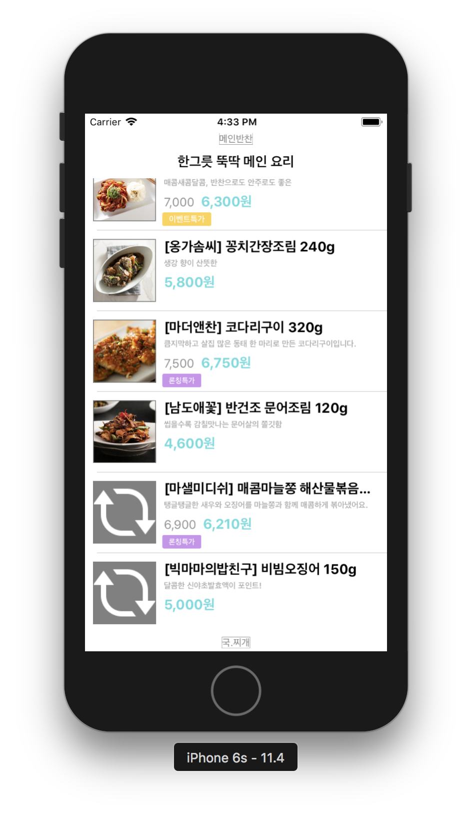

# 스토어 앱

## 완성화면

### Step1 (2018.07.09)

### Step2 (2018.07.10)
- 오토레이아웃 적용
- 

### Step3 (2018.07.12)
- 커스텀 헤더 적용
- 

### Step4 (2018.07.12)
- Toaster 라이브러리 사용
- 

### Step5 (2018.07.23)
- `insertRows()`, `URLSession.shared.dataTask`
- 

### Step5 (2018.07.26)
- 이미지 다운로드 병렬처리
- `URLSession.shared.downloadTask`, `FileManager` 
- 
- 상품 이미지를 로드할 수 없을 때 refresh 이미지 표시
- 
