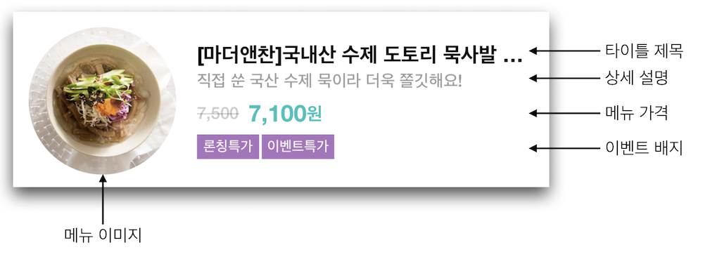
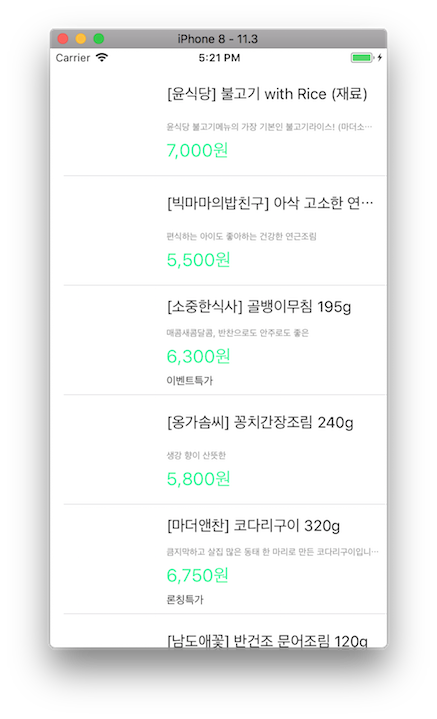

# 쇼핑 앱

## Step1 (시작하기 - 상품 목록)
### 요구사항
- iOS 프로젝트 Single View App 템플릿으로 하고 프로젝트 이름을 "StoreApp"으로 지정하고, 위에 만든 로컬 저장소 경로에 생성한다.
- 기본 상태로 아이폰 8 시뮬레이터를 골라서 실행한다.
- readme.md 파일을 자신의 프로젝트에 대한 설명으로 변경한다.
	- 단계별로 미션을 해결하고 리뷰를 받고나면 readme.md 파일에 주요 작업 내용(바뀐 화면 이미지, 핵심 기능 설명)과 완성 날짜시간을 기록한다.
	- 실행한 화면을 캡처해서 readme.md 파일에 포함한다.

### 프로그래밍 요구사항
- 스토리보드 ViewController에 TableView를 추가하고 Safe 영역에 가득 채우도록 frame을 설정한다.
- 테이블뷰에 새로운 프로토타입 Cell을 추가하고, Custom 스타일로 지정하고 다음과 같이 디자인한다.

- main.json 데이터 파일을 다운로드해서 프로젝트에 복사하고 JSONDecoder를 활용해서 내부에 Array<StoreItem> 타입으로 변환하는 DataSource에서 사용할 모델 객체를 만든다.
	- subscript로 배열에 index로 접근하면 StoreItem 구조체를 반환한다.
	- StoreItem은 Decodable 프로토콜을 채택하고, main.json에 있는 키와 값을 매핑해서 속성으로 갖도록 구현한다.
- UITableViewDataSource 프로토콜 구현 부분에서 cell을 위에서 만든 DataSource 모델 객체에 접근해서 테이블뷰를 표시한다.
	- 이미지뷰에 image는 아직 표시하지 않는다.

### 결과
#### UI

---
## 중간에 고생했던 부분 / 기억할 부분 간단 정리
- JSONDecoder().decode([StoreItem].self, from: data) 를 통해 데이터를 직접 객체에 바인딩 가능하다.
