# 쇼핑 앱

## Step1 (시작하기 - 상품 목록)
### 요구사항
- iOS 프로젝트 Single View App 템플릿으로 하고 프로젝트 이름을 "StoreApp"으로 지정하고, 위에 만든 로컬 저장소 경로에 생성한다.
- 기본 상태로 아이폰 8 시뮬레이터를 골라서 실행한다.
- readme.md 파일을 자신의 프로젝트에 대한 설명으로 변경한다.
	- 단계별로 미션을 해결하고 리뷰를 받고나면 readme.md 파일에 주요 작업 내용(바뀐 화면 이미지, 핵심 기능 설명)과 완성 날짜시간을 기록한다.
	- 실행한 화면을 캡처해서 readme.md 파일에 포함한다.

### 프로그래밍 요구사항
- 스토리보드 ViewController에 TableView를 추가하고 Safe 영역에 가득 채우도록 frame을 설정한다.
- 테이블뷰에 새로운 프로토타입 Cell을 추가하고, Custom 스타일로 지정하고 다음과 같이 디자인한다.

- main.json 데이터 파일을 다운로드해서 프로젝트에 복사하고 JSONDecoder를 활용해서 내부에 Array<StoreItem> 타입으로 변환하는 DataSource에서 사용할 모델 객체를 만든다.
	- subscript로 배열에 index로 접근하면 StoreItem 구조체를 반환한다.
	- StoreItem은 Decodable 프로토콜을 채택하고, main.json에 있는 키와 값을 매핑해서 속성으로 갖도록 구현한다.
- UITableViewDataSource 프로토콜 구현 부분에서 cell을 위에서 만든 DataSource 모델 객체에 접근해서 테이블뷰를 표시한다.
	- 이미지뷰에 image는 아직 표시하지 않는다.

### 결과
#### UI


---
## Step2 (오토레이아웃 AutoLayout 적용)
### 요구사항
- 오토레이아웃 방식에 대해 학습하고 여러 종류 아이폰 화면에서 모두 보이도록 대응하는 UI를 완성하는 것을 목표로 한다.
- readme.md 파일을 자신의 프로젝트에 대한 설명으로 변경한다.
	- 단계별로 미션을 해결하고 리뷰를 받고나면 readme.md 파일에 주요 작업 내용(바뀐 화면 이미지, 핵심 기능 설명)과 완성 날짜시간을 기록한다.
	- 실행한 화면을 캡처해서 readme.md 파일에 포함한다.

### 프로그래밍 요구사항
- 스토리보드 ViewController에 Cell을 Content View를 기준으로 하위 뷰들에 오토레이아웃을 적용한다.
	- 메뉴 이미지 뷰는 top, bottom, lead 제약을 주고 width 제약을 넣는다. height와 width 비율은 1:1로 aspectRatio를 맞춘다.
	- 타이틀 제목은 메뉴 이미지보다 10pt 우측에 lead 제약을 주고, top, tail 제약을 주고, height 제약을 준다.
	- 상세 설명도 top 제약만 타이틀 제목보다 4pt 띄우고, 나머지는 타이틀에 맞춘다.
	- 메뉴 가격도 width 제약을 넣고, 나머지는 타이틀과 마찬가지로 제약을 준다.
	- 이벤트 배지는 최소width 제약만 주고 글자 내용에 맞추고, 없을 경우 감춘다.
- 모든 아이폰 사이즈에 대응해서 잘리는 화면이 없이 나와야 한다.
	- 아이폰 5s, 6,7,8 계열, 6+, 7+, 8+계열과 아이폰 X 모두 정상적으로 화면이 나오는지 확인한다.

### 결과
#### UI
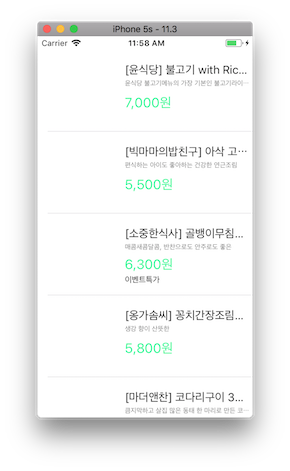
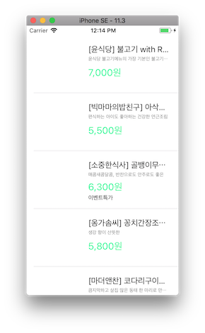
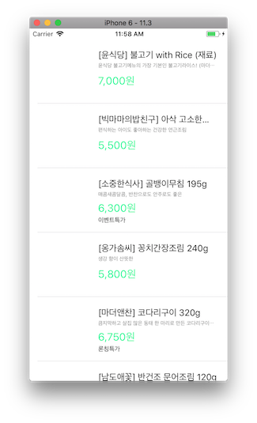

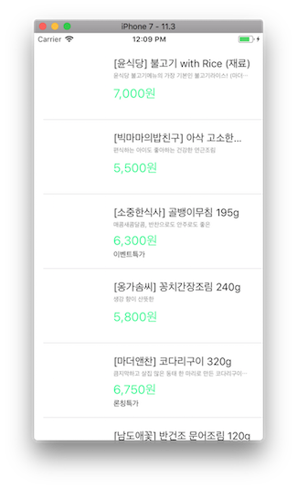
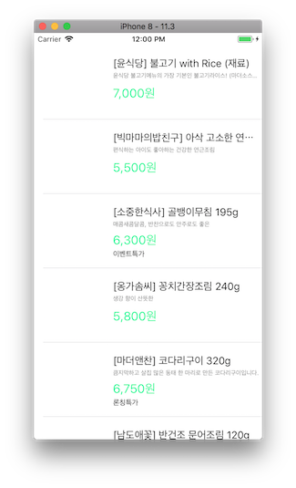
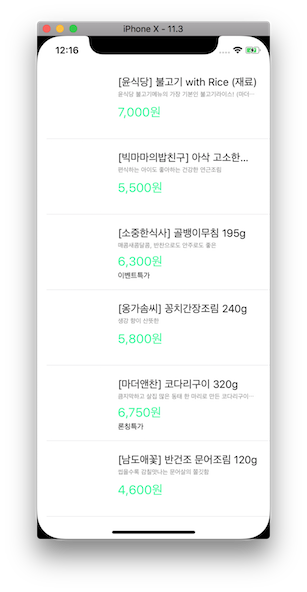
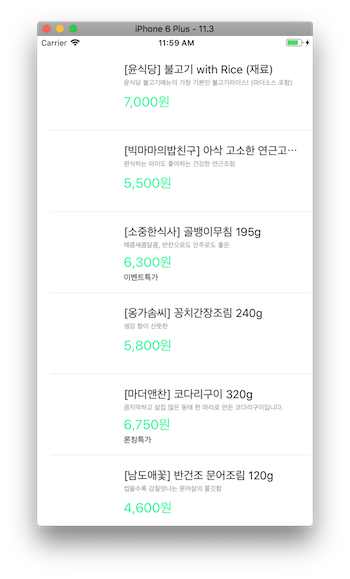

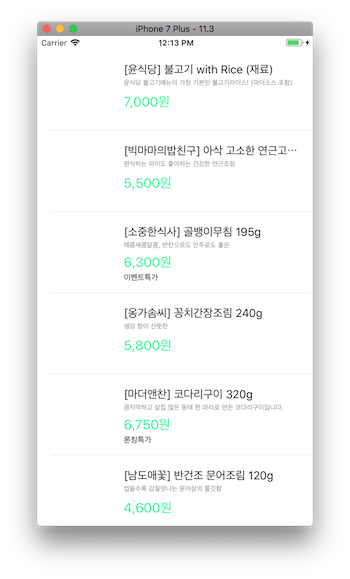


---
## Step3 (Custom Section 헤더 적용)
### 요구사항
- 데이터를 추가하고 오토레이아웃을 적용한 상품목록 - 테이블뷰를 완성하는 것을 목표로 한다.
- readme.md 파일을 자신의 프로젝트에 대한 설명으로 변경한다.
	- 단계별로 미션을 해결하고 리뷰를 받고나면 readme.md 파일에 주요 작업 내용(바뀐 화면 이미지, 핵심 기능 설명)과 완성 날짜시간을 기록한다.
	- 실행한 화면을 캡처해서 readme.md 파일에 포함한다.

### 프로그래밍 요구사항
- soup.json, side.json 파일을 다운로드해서 프로젝트에 복사하고 JSONDecoder를 활용해서 모델 객체를 기존 main과 함께 섹션(section)을 구분할 수 있도록 개선한다.
- 스토리보드 ViewController에 Cell에 Section Header로 사용할 Custom Cell을 추가한다.
	- 총 섹션은 3개로 구분해서 헤더에 다음과 같이 표시한다.
	- main => ```메인반찬 / 한그릇 뚝딱 메인 요리```
	- soup => ```국.찌게 / 김이 모락모락 국.찌게```
	- side => ```밑반찬 / 언제 먹어도 든든한 밑반찬```

### 결과
#### UI
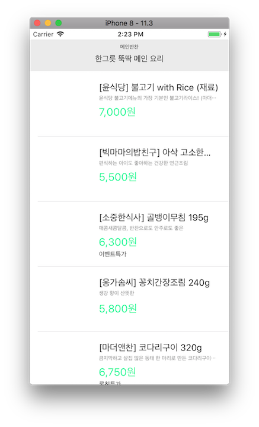
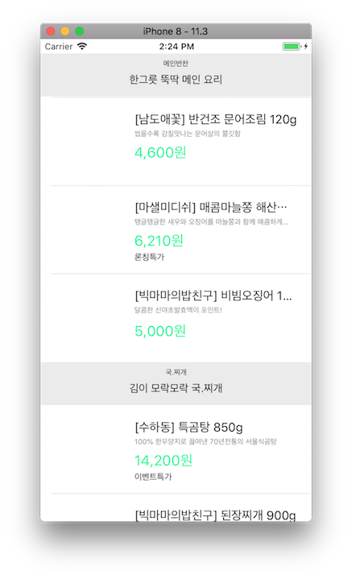
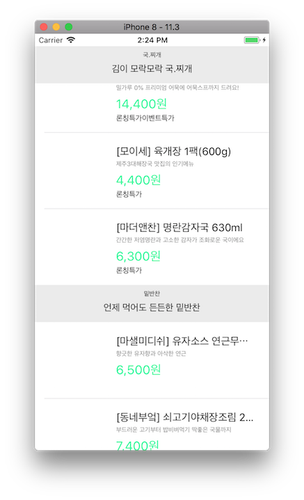
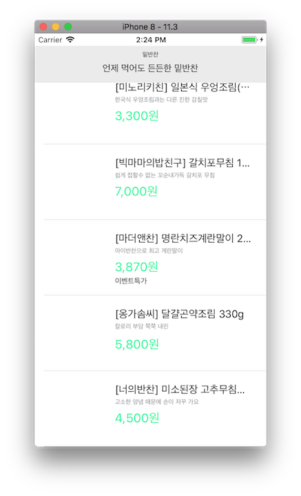

---
## 중간에 고생했던 부분 / 기억할 부분 간단 정리
- JSONDecoder().decode([StoreItem].self, from: data) 를 통해 데이터를 직접 객체에 바인딩 가능하다.
- 위 코드를 Swift 4.1 새로 추가된 내용에 의해 변경
```
let decoder = JSONDecoder()
decoder.keyDecodingStrategy = .convertFromSnakeCase
return try decoder.decode([StoreItem].self, from: data)
```
가운데 줄의 ```decoder.keyDecodingStrategy = .convertFromSnakeCase``` 가 새로 추가된 부분.
JSON데이터의 snakeCase형식의 키를 camelCase로 자동으로 커스터마이징 해준다.
- UITableViewDelegate 과 UITableViewDatasource
```
UITableViewDelegate
Serving as a table's delegate means you provide answers to requests about the layout of the table and about actions the user performs on the tableview. Layout methods include the tableview asking about the height of rows, headers, and footers, what the buttons should look like, etc. Action methods include the user selecting a row and beginning and ending the editing of a row.
   
UITableViewDatasource
Serving as a table's datasource means you provide data for the sections and rows of a table and you act on messages that change a table's data. The datasource is asked for the data for a cell when the table is drawn, is told that the user has asked to delete a row, and is told the new value of a row that the user has edited.
```
	- Delegate의 경우 action이나 TableView의 속성 등을 사용자의 요구에 맞게 표현하도록 하는 프로토콜
	- DataSource의 경우 모델 등 데이터를 TableView에 표현하기 위한 프로토콜
 