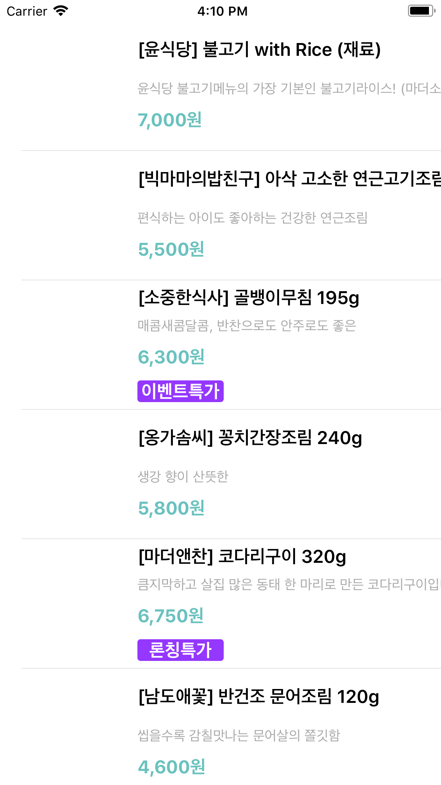

# - Step1 (상품 목록)

## 요구사항
- 스토리보드 ViewController에 TableView를 추가하고 Safe 영역에 가득 채우도록 frame을 설정한다.
- 테이블뷰에 새로운 프로토타입 Cell을 추가하고, Custom 스타일로 지정하고 다음과 같이 디자인한다.
- main.json 데이터 경로 => http://public.codesquad.kr/jk/storeapp/main.json
- 위 파일을 다운로드해서 프로젝트에 복사하고 JSONDecoder를 활용해서 내부에 Array<StoreItem> 타입으로 변환하는 DataSource에서 사용할 모델 객체를 만든다.
	- subscript로 배열에 index로 접근하면 StoreItem 구조체를 반환한다.
	- StoreItem은 Decodable 프로토콜을 채택하고, main.json에 있는 키와 값을 매핑해서 속성으로 갖도록 구현한다.
- UITableViewDataSource 프로토콜 구현 부분에서 cell을 위에서 만든 DataSource 모델 객체에 접근해서 테이블뷰를 표시한다.

## 실행화면

