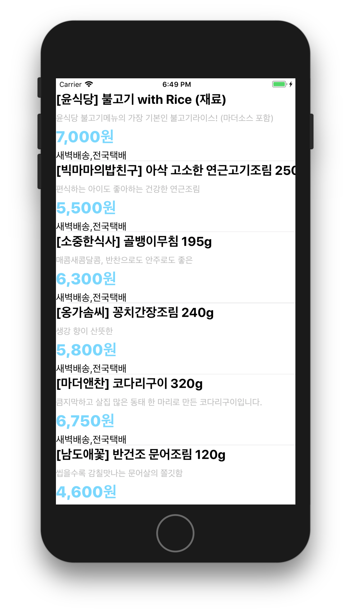
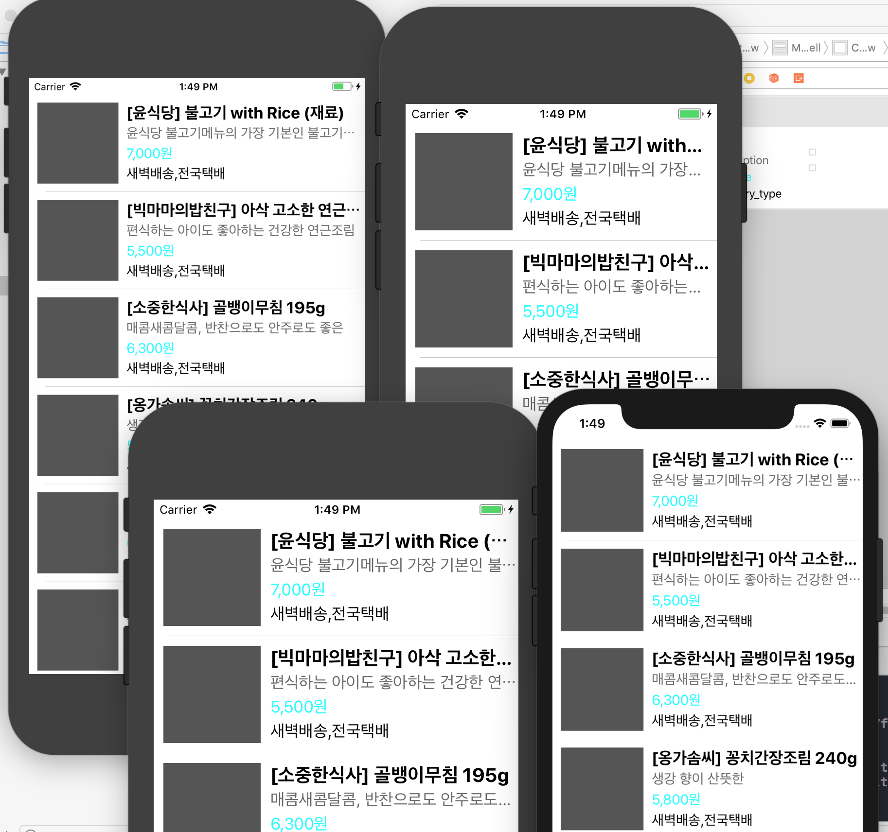
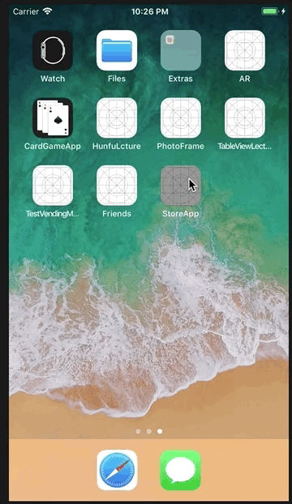
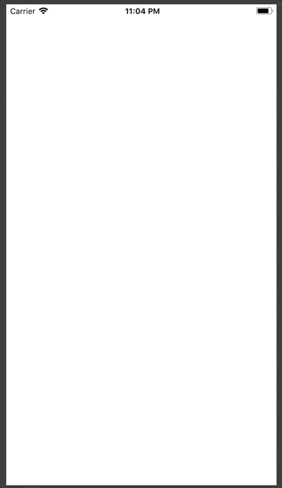
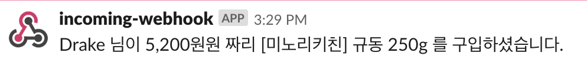

# 쇼핑앱

-

# 스텝 1. 상품 목록

### 요구사항

- 스토리보드 ViewController에 TableView를 추가하고 Safe 영역에 가득 채우도록 frame을 설정한다.
- 테이블뷰에 새로운 프로토타입 Cell을 추가하고, Custom 스타일로 지정하고 다음과 같이 디자인한다.

- JSON 파일을 받아서 JSONDecoder를 활용해서 내부에 Array<StoreItem> 타입으로 변환하는 DataSource에서 사용할 모델 객체를 만든다.
	* subscript로 배열에 index로 접근하면 StoreItem 구조체를 반환한다.
	* StoreItem은 Decodable 프로토콜을 채택하고, main.json에 있는 키와 값을 매핑해서 속성으로 갖도록 구현한다.
- UITableViewDataSource 프로토콜 구현 부분에서 cell을 위에서 만든 DataSource 모델 객체에 접근해서 테이블뷰를 표시한다.

### 작동화면

### 구현내용

- json 배열을 객채 배열로 구현
- 테이블뷰 내부에 커스텀 셀 구현
- 커스텀 셀 내부 이미지뷰 와 스택뷰 구성
	* 스택뷰 내부에 Label 구성
	* 스택뷰는 autoLayout 적용

-

# step 2. 오토레이아웃 적용

### 요구사항

 - 스토리보드 ViewController에 Cell을 Content View를 기준으로 하위 뷰들에 오토레이아웃을 적용한다.
	* 메뉴 이미지 뷰는 top, bottom, lead 제약을 주고 width 제약을 넣는다. 
	* height와 width 비율은 1:1로 aspectRatio를 맞춘다.
타이틀 제목은 메뉴 이미지보다 10pt 우측에 lead 제약을 주고, top, tail 제약을 주고, height 제약을 준다.
	* 상세 설명도 top 제약만 타이틀 제목보다 4pt 띄우고, 나머지는 타이틀에 맞춘다.
	* 메뉴 가격도 width 제약을 넣고, 나머지는 타이틀과 마찬가지로 제약을 준다.
	* 이벤트 배지는 최소width 제약만 주고 글자 내용에 맞추고, 없을 경우 감춘다.

### 작동화면

### 구현내용

- 이미지 constraints
	* leading,top,bottom spacing to superVeiw = 10 px
	* width 100
	* aspect 1:1

- label
	* label 을 스택뷰 내부에 구현
	* leading spacing to 이미 = 10
	* fill Equally
	* 스타일 설정 : 제목 두껍게, 설명 회색, 가격 파랑색 

	
-

# step 3. Custom Section 헤더 적용

### 요구사항

- 데이터를 추가하고 오토레이아웃을 적용한 상품목록 - 테이블뷰를 완성하는 것을 목표로 한다.
- 다음 2개 파일을 다운로드해서 프로젝트에 복사하고 JSONDecoder를 활용해서 모델 객체를 기존 main과 함께 섹션(section)을 구분할 수 있도록 개선한다.
- 스토리보드 ViewController에 Cell에 Section Header로 사용할 Custom Cell을 추가한다.

	* 총 섹션은 3개로 구분해서 헤더에 다음과 같이 표시한다.
	* main => 메인반찬 / 한그릇 뚝딱 메인 요리
	* soup => 국.찌게 / 김이 모락모락 국.찌게
	* side => 밑반찬 / 언제 먹어도 든든한 밑반찬

### 실행화면

### 구현방법

- 커스텀 헤더 추가 
	* xib 파일로 뷰와 레이블 구현
- 헤더 내용을 담는 헤더컨텐트매니저 추가
	* 헤더내용객체를 배열로 소유
- 데이터소스가 델리게이트 채택
	* 헤더컨텐트매니저에서 헤더내용 추출, 헤더로 전달

	
-
	
# step 4. 패키지 관리 CocoaPod

### 요구조건

- Cocoapod 를 설치한다. 
 - https://github.com/devxoul/Toaster 저장소에 있는 Toaster 패키지를 cocoapod 으로 설치한다.
 - pod으로 설치한 Toaster 모듈을 import 하고 테이블뷰 셀을 터치하면 (didSelect) 타이틀 메뉴와 (할인된)최종 가격 정보를 toast 형태로 표시한다.

 
### 작동화면

### 구현방법

- cocoapod 설치 
- cocoapod 를 통해서 Toaster 추가
- indexPath 를 받아서 storeItem 의 제목과 가격을 리턴하는 함수 추가
- 셀 선택시 이전에 있던 Toaster 삭제하고 새 Toaster 출력

-

# step 5 Network 프로그래밍

### 요구사항

- 아래 주소별로 JSON 데이터를 받아오는 모델 객체를 만든다.
	* HTTP 프로토콜 GET 요청으로 메인반찬, 국.찌게, 밑반찬 JSON 데이터를 받는다. 
- HTTP 요청은 URLSession 관련 프레임워크를 활용한다.
- 응답으로 받은 JSON 데이터를 마찬가지 방법으로 Decode해서 StoreItem 객체로 변환한다.
- 모델 객체는 응답이 도착하면 섹션별로 데이터를 바꾸고 각각 - Notification을 보내서 테이블뷰의 해당 섹션만 업데이트한다.

### 작동화면

### 구현내용

- urlSession 이용해서 데이터를 가져오는 객체, 함수 생성
- 가져온 JSON 데이터를 객체화 
- 객체가 생성되면 이하의 단계 Custom DispatchQueue.sync 동기로 진행
	* 생성된 객체를 UITableViewDataSourceObejct 에 입력
	* 입력된 섹션만 reloadSection 
	* reloadSection 은 DispatchQueue.main.sync 동기로 진행

-

# step 6 병렬처리

### 요구사항
 
- 3개의 JSON 데이터가 모두 받고 나면 JSON 데이터에 포함된 이미지 URL을 분리해서 Image 파일들을 다운로드 받는다.
- 이미지 파일들을 병렬처리해서 한꺼번에 여러개를 다운로드하도록 구성한다.
	* (선택1) GCD Queue를 활용하거나
	* (선택2) Download Task 방식으로 구현한다.
- 다운로드가 완료되면 앱 디렉토리 중에 Cache 디렉토리에 URL에 있는 파일명으로 저장한다.
- 셀을 표기할 때 이미 다운로드된 이미지가 있으면 표시하고, 새로운 파일이 다운로드 완료되면 해당 이미지를 테이블뷰 셀에 뒤늦게(lazy) 표시한다.
	* 화면에 표시할 때 다운로드를 담당하는 스레드와 화면을 처리하는 스레드를 위한 GCD Queue를 구분해서 처리한다.
	* 이미지를 다 받을때 까지 화면이 하얗게 멈춰있지 않도록 만든다.

### 동작화면

### 구현내용

- 이미지 파일 다운로드는 Download Task 방식으로 구현
- 리로드가 완료된 섹션의 스토어 아이템 이미지 url 을 추출
- 모든 섹션 데이터 입력 및 리로드가 왼료되면 저장한 url 에서 이미지 파일 다운로드
- 다운 완료시 노티 포스트 - 스토어 아이템 이미지파일주소 에 적용
- 적용된 아이템만 main 비동기로 row reload
- url 이미지 다운 실패시 탈출클로저 사용, 다시 받도록 반복

-

# step 7 상품 상세화면 전환

### 요구사항

- ViewController 를 Navigation Controller로 embed
- cell을 선택하면 상품 상세 화면을 보이도록 새로운 뷰 컨트롤러 생성
- 상세 화면(DetailViewController)으로 선택한 cell의 detail_hash 값을 전달하세요.
- 상세 화면에 대한 Delegate 프로토콜과 프로토콜을 채택하는 속성을 추가하세요.
	* 상세 화면에서 결과를 전달하기 위한 Delegate 프로토콜을 선언하세요.
	* 프로토콜에는 주문을 완료했을 때 호출할 메소드를 선언하세요.
	* ViewController에는 프로토콜을 채택하고 위의 메소드를 구현하세요.
- URL 형식으로 요청하고 받은 JSON 데이터를 Decode 하는 네트워크 담당 모델 객체를 만드세요.
- 참고로 실제 이미지는 HBDEF, HDF73, H602F, H0FC6, HAA47, H26C7 를 제외한 나머지는 다른 제품의 이미지가 보일 수 있음
- 상세 화면을 표시하기 전에 네트워크 담당 모델 객체에서 데이터를 받아서 화면 정보를 채워서 표시하세요.
	* self.view 커스텀 클래스를 UIScrollView로 지정하고 하위 뷰들은 self.view.contentView 에 추가하세요.
	* ScrollView ContentSize에 대해 찾아보고, 전체 콘텐츠 높이를 계산해서 스크롤되도록 값을 지정하세요.
	* 상단 ScrollView 에 thumb_images 항목의 이미지들을 Page 형태로 추가하세요. 좌우로 페이지 넘기듯이 넘어가도록 만드세요.
	* 설명 아래부분에는 제품 상세 설명을 위해서 detail_section 항목의 이미지들을 코드로 이어서 붙이세요.
- [주문하기] 버튼을 누르면 델리게이트 객체에 주문 완료 메소드를 호출합니다.
	* 프로토콜 채택한 객체는 슬랙으로 “누가-얼마짜리-메뉴” 주문을 POST 요청으로 보내는 기능을 네트워크 모델에 추가하세요.
	* 주문을 완료하고 나면 창을 닫고 이전 화면으로 돌아가도록 작성하세요.
	* 슬랙 incoming hook URL 을 사용하세요.

### 작동화면

- 슬랙 webhook 으로 POST 

### 구현내용 

- 디테일 화면을 담당하는 뷰를 UIScrollView 로 선언
- 이미지 미리보기 화면 가로 스크롤뷰로 구현
	* page 스타일 적용
- 이미지 추가는 GCD 동기로 적용
	* 스크롤뷰 생성 후 이미지 로딩을 동기로 적용
	* 로딩 되는대로 이미지 추가
- 스크롤 뷰에 이미지 추가시 content size 조정해서 추가
- 상세페이지용 url 을 받아서 JSON 데이터 다운로드
- JSON 데이터에서 상세내용 객체 구현
- 상세내용 먼저 출력하고 사진은 비동기로 추가
- 주문하기 버튼 toolbar 로 구현
- 델리게이트 패턴 구현
	* 주문완료 함수를 가지는 주문완료델리게이트 구현
	* 목록 뷰컨이 채택
	* 상세화면 뷰컨이 변수로 주문완료 델리게이트 추가
	* segue 전달시 self 로 델리게이트 삽입
	* 주문하기 버튼을 델리게이트 함수와 연결
- 주문완료시 주문내용 POST 로 슬랙 webhook 에 전달