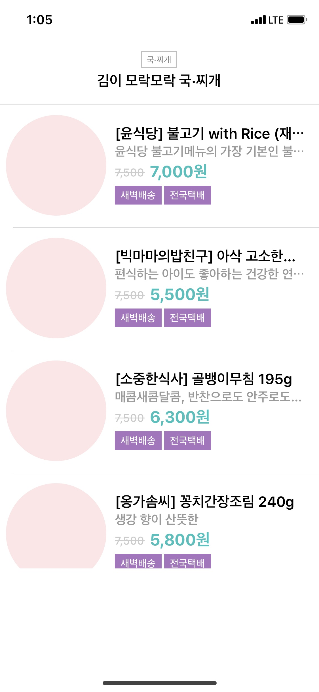

# 스위프트 쇼핑앱

## 요구사항

## 5. Network 프로그래밍 

#### 요구사항

- [쇼팽앱 패키지관리](https://nextstep.camp/courses/-Kv6PmBDDnfeJOzqThWG/-Kv6VFlxhUm2sqJmkFNF/lessons/-L2TQl3THfAWHTJofJkX) 요구사항을 구현한 상태에서 시작한다. 
- 네트워크 프로그래밍 관련 자료를 보고 학습한다. [강의자료](http://public.codesquad.kr/jk/storeapp-network-slide.pdf)
- HTTP 프로토콜에 대해 학습하고 요청과 응답 방식에 대해 정리한다.
- 네트워크 프로그래밍을 위해서 Asynchronous 방식으로 동작하는 개념을 학습한다.
- readme.md 파일을 자신의 프로젝트에 대한 설명으로 변경한다.
  - 단계별로 미션을 해결하고 리뷰를 받고나면 readme.md 파일에 주요 작업 내용(바뀐 화면 이미지, 핵심 기능 설명)과 완성 날짜시간을 기록한다.
  - 실행한 화면을 캡처해서 readme.md 파일에 포함한다.

#### 프로그래밍 요구사항

- 아래 주소별로 JSON 데이터를 받아오는 모델 객체를 만든다.
  - HTTP 프로토콜 GET 요청으로 다음 주소에서 메인반찬 JSON 데이터를 받는다. `http://crong.codesquad.kr:8080/woowa/main`
  - HTTP 프로토콜 GET 요청으로 다음 주소에서 국.찌게 JSON 데이터를 받는다. `http://crong.codesquad.kr:8080/woowa/soup`
  - HTTP 프로토콜 GET 요청으로 다음 주소에서 밑반찬 JSON 데이터를 받는다. `http://crong.codesquad.kr:8080/woowa/side`
- (위 API들은 오전9시부터 밤12시까지만 동작한다.)
- HTTP 요청은 URLSession 관련 프레임워크를 활용한다.
- 응답으로 받은 JSON 데이터를 마찬가지 방법으로 Decode해서 StoreItem 객체로 변환한다.
- 모델 객체는 응답이 도착하면 Notification을 보내서 테이블뷰의 해당 섹션만 업데이트한다.

## 작업 이력

### 5. Network 프로그래밍 

#### 주요 작업 내역

- URLSession를 활용한 HTTP요청
- Section별로 다른 Session을 만들어 HTTP요청 후, 각각의 응답에따른 각각의 화면 갱신
- 몇 코드 정리

#### 날짜

- 2018-07-09 21:23

#### 스크린샷

| 네트워크 통신 전                    | 네트워크 통신 후                    |
| ----------------------------------- | ----------------------------------- |
|  |  |

### 4. 패키지 관리 - CocoaPod

#### 주요 작업 내역

- Pod을 이용한 Toast 라이브러리 사용
- 셀을 누를시 토글로 정보(타이틀, 할인된 가격) 표시

#### 날짜

- 2018-07-08 15:53

#### 스크린샷

### 3. Custom Section 헤더 적용

#### 주요 작업 내역

- 로컬에있는 3개의  json 파일을 각각 불러와 섹션별로 출력
- 커스텀 섹션 헤더 적용

#### 날짜

- 2018-07-08 15:22

#### 스크린샷

|                      섹션1                       |                      섹션2                       |                      섹션3                       |
| :----------------------------------------------: | :----------------------------------------------: | :----------------------------------------------: |
|  |  |  |

### 2. 오토레이아웃

#### 주요 작업 내역

- 상단 Section Header에 오토레이아웃 적용
- 위 요구사항대로 Cell에 오토레이아웃 적용

#### 날짜

- 2018-07-08 13:44

#### 스크린샷

각 디바이스별 스크린샷은 [resource/iphone-big](resource/iphone-big), [resource/iphone-small](resource/iphone-small)에 저장되어 있습니다.

### 1. 상품 목록

#### 주요 작업 내역

- 로컬에있는 json  파일 불러와 TableView에 출력
- 상단의 섹션헤더 추가 
- Cell 내부에 동적으로 태그 Label 출력

#### 날짜

- 2018-07-08 12:52

#### 스크린샷

