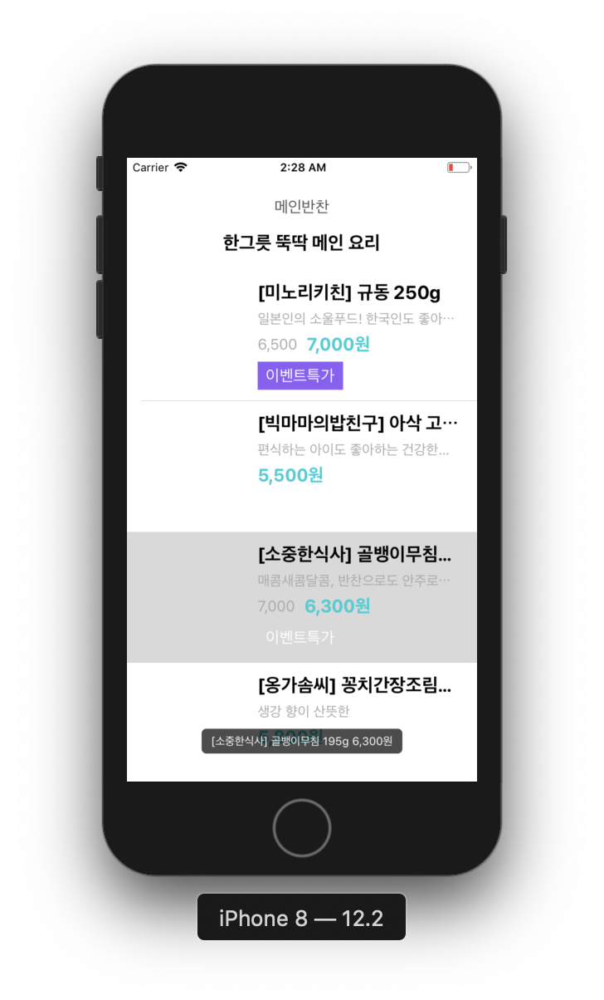

# Store App

## Step 1

-   상품 정보가 담긴 json을 읽어서 tableView에 출력
-   headerView를 추가하여 현재 section이 어떤 상품에 대한 정보를 다루고 있는지 알려줌

## Step 2

-   여러 개의 상품 정보가 담긴 json을 읽어서 tableView에서 section으로 나누어 출력
-   각 상품 분류에 대한 headerView를 추가하여 현재 section이 어떤 상품에 대한 정보를 다루고 있는지 알려줌

## Step 3

-   CocoaPods을 이용해 Toaster 라이브러리 설치
-   tableViewCell 선택 시 Toaster 출력
