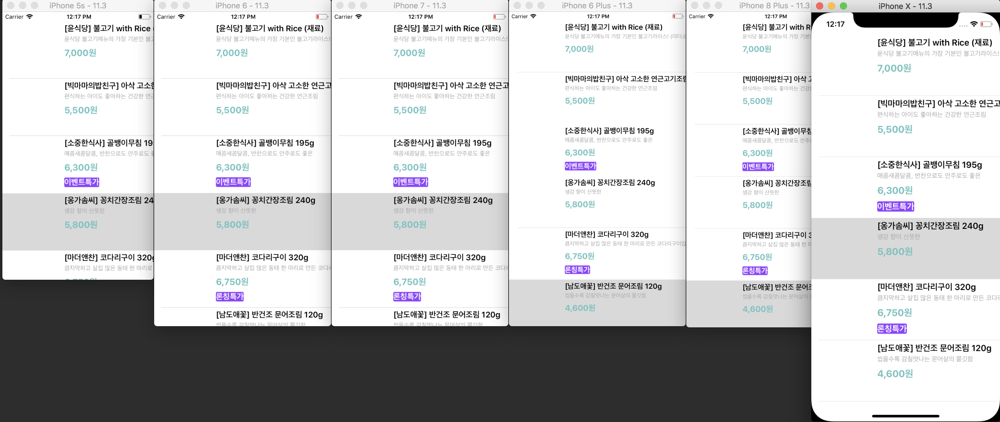
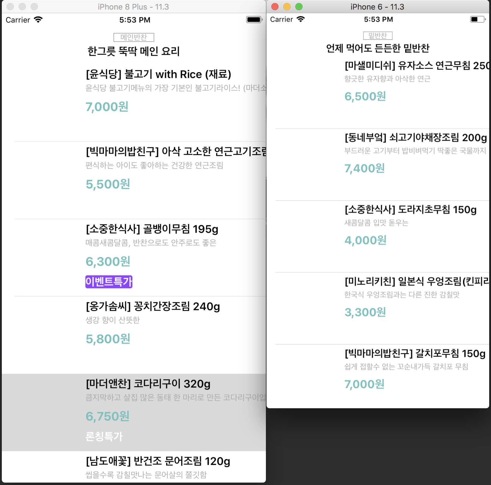
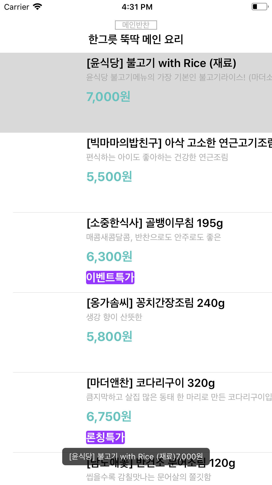
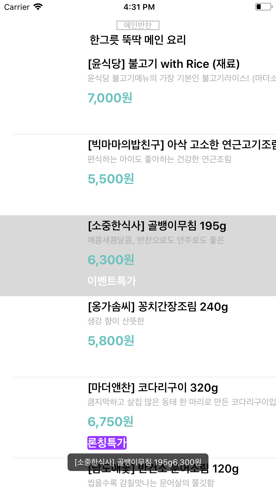

# - Step1 (상품 목록)

## 요구사항
- 스토리보드 ViewController에 TableView를 추가하고 Safe 영역에 가득 채우도록 frame을 설정한다.
- 테이블뷰에 새로운 프로토타입 Cell을 추가하고, Custom 스타일로 지정하고 다음과 같이 디자인한다.
- main.json 데이터 경로 => http://public.codesquad.kr/jk/storeapp/main.json
- 위 파일을 다운로드해서 프로젝트에 복사하고 JSONDecoder를 활용해서 내부에 Array<StoreItem> 타입으로 변환하는 DataSource에서 사용할 모델 객체를 만든다.
	- subscript로 배열에 index로 접근하면 StoreItem 구조체를 반환한다.
	- StoreItem은 Decodable 프로토콜을 채택하고, main.json에 있는 키와 값을 매핑해서 속성으로 갖도록 구현한다.
- UITableViewDataSource 프로토콜 구현 부분에서 cell을 위에서 만든 DataSource 모델 객체에 접근해서 테이블뷰를 표시한다.

## 실행화면

# - Step2 ( AutoLayout 적용 )

## 요구사항
- 스토리보드 ViewController에 Cell을 Content View를 기준으로 하위 뷰들에 오토레이아웃을 적용한다.
	- 메뉴 이미지 뷰는 top, bottom, lead 제약을 주고 width 제약을 넣는다. height와 width 비율은 1:1로 aspectRatio를 맞춘다.
	- 타이틀 제목은 메뉴 이미지보다 10pt 우측에 lead 제약을 주고, top, tail 제약을 주고, height 제약을 준다.
	- 상세 설명도 top 제약만 타이틀 제목보다 4pt 띄우고, 나머지는 타이틀에 맞춘다.
	- 메뉴 가격도 width 제약을 넣고, 나머지는 타이틀과 마찬가지로 제약을 준다.
	- 이벤트 배지는 최소width 제약만 주고 글자 내용에 맞추고, 없을 경우 감춘다.

## 실행화면

## AutoLayout
-  

## Priority & isActive
 - 우선순위, Priority는 UILayoutPriority로 설정할 수 있으며 1에서 1000까지의 값을 갖는다.
 - Required는 1000, DefaultHigh는 750, DefaultLow는 250의 기본값을 갖는다.
  	- 세 가지 우선순위로 제약조건이 걸려있는 경우 1000이 가장 높은 영향력을 가지며, 1000이 없어진 경우 750, 750이 없어진 경우 250, 순차적으로 연결된다.
 - Constraint의 isActive를 true/false로 변경하면 해당 값을 활성화/비활성화할 수 있다. 단, 이때 해당 Constraint가 weak으로 연결되면 ARC 문제로 해제될 경우가 있으므로 Strong으로 연결해야 한다.

# - Step3 ( Custom Section 헤더 적용 )
## 요구사항
- 다음 2개 파일을 다운로드해서 프로젝트에 복사하고 JSONDecoder를 활용해서 모델 객체를 기존 main과 함께 섹션(section)을 구분할 수 있도록 개선한다.
	- soup.json 데이터 경로 => http://public.codesquad.kr/jk/storeapp/soup.json
	- side.json 데이터 경로 => http://public.codesquad.kr/jk/storeapp/side.json

- 스토리보드 ViewController에 Cell에 Section Header로 사용할 Custom Cell을 추가한다.
	- 총 섹션은 3개로 구분해서 헤더에 다음과 같이 표시한다.
	- main => 메인반찬 / 한그릇 뚝딱 메인 요리
	- soup => 국.찌게 / 김이 모락모락 국.찌게
	- side => 밑반찬 / 언제 먹어도 든든한 밑반찬

## 실행화면

# - Step4 ( Cocoapods )
## 요구사항
- Cocoapod 를 설치한다.
	- https://github.com/devxoul/Toaster 저장소에 있는 Toaster 패키지를 cocoapod 으로 설치한다.
	- pod으로 설치한 Toaster 모듈을 import 하고 테이블뷰 셀을 터치하면 (didSelect) 타이틀 메뉴와 (할인된)최종 가격 정보를 toast 형태로 표시한다.

## 실행화면

## 학습꺼리
- 다른 패키지 매니저 도구가 어떤게 있는지 학습하고 비교해서 정리한다.
(https://medium.com/xcblog/carthage-or-cocoapods-that-is-the-question-1074edaafbcb)

	- CocoaPods
		- 장점 : 설치 및 사용이 쉽고, 커뮤니티가 크고 활발하다.(대부분의 오픈소스가 포함되어있음)
		- 단점 : 프로젝트 내용 및 파일을 자동으로 알지 못하는 방향으로 수정하는 경우가 있다.

	- Carthage
		- 장점 : 프로젝트를 건들지 않아 정확한 컨트롤이 가능하다.
	  - 단점 : 느리고, 커뮤니티가 크지 않다.

	- Swift Package Manager
		- 장점 : Apple에서 공식 지원한다.
		- 단점 : 초창기, 표준 Swift Package의 Directory 구조를 따라야 한다.

- 프로젝트 설정과 관련된 용어에 대해 학습하고 정리한다.(https://stackoverflow.com/questions/20637435/xcode-what-is-a-target-and-scheme-in-plain-language/20637892#20637892)
	- Workspace - Contains one or more projects. These projects usually relate to one another
	- Project - Contains code and resources, etc. (You'll be used to these!)
	- Target - Each project has one or more targets.
		- Each target defines a list of build settings for that project
		- Each target also defines a list of classes, resources, custom scripts etc to include/ use when building.
		- Targets are usually used for different distributions of the same project.
			- For example, my project has two targets, a "normal" build and an "office" build that has extra testing features and may contain several background music tracks and a button to change the track (as it currently does).
			- You'll be used to adding classes and resources to your default target as you add them.
			- You can pick and choose which classes / resources are added to which target.
				- In my example, I have a "DebugHandler" class that is added to my office build
			- If you add tests, this also adds a new target.
	- Scheme - A scheme defines what happens when you press "Build", "Test", "Profile", etc.
		- Usually, each target has at least one scheme
		- You can autocreate schemes for your targets by going to Scheme > Manage Schemes and pressing "Autocreate Schemes Now"

# - Step5 ( Network 프로그래밍 )
## 요구사항
- 아래 주소별로 JSON 데이터를 받아오는 모델 객체를 만든다.
	- HTTP 프로토콜 GET 요청으로 다음 주소에서 메인반찬 JSON 데이터를 받는다. http://crong.codesquad.kr:8080/woowa/main
	- HTTP 프로토콜 GET 요청으로 다음 주소에서 국.찌게 JSON 데이터를 받는다. http://crong.codesquad.kr:8080/woowa/soup
	- HTTP 프로토콜 GET 요청으로 다음 주소에서 밑반찬 JSON 데이터를 받는다. http://crong.codesquad.kr:8080/woowa/side
- HTTP 요청은 URLSession 관련 프레임워크를 활용한다.
- 응답으로 받은 JSON 데이터를 마찬가지 방법으로 Decode해서 StoreItem 객체로 변환한다.
- 모델 객체는 응답이 도착하면 Notification을 보내서 테이블뷰의 해당 섹션만 업데이트한다.

## 학습꺼리
### 1. 네트워크의 역사
  - 네트워크란? 정보를 옮기는 것.
  - 예전에는 전화국이 있었음. (Telephone excahange -> Bule-box 등등)
  - IETF라는 기관이 생김. 네트워크 관련 약자들을 다 표준화 시킴.

### 2. iOS Networking
  - Application 하위로 3개의 API를 사용할 수 있음.
    - Foundation,  CFNetwork, Core OS(Darwin)

  - 고려해야될 사항
    - Packet Problems : 기존 유선의 네트워킹에선 Circuit(하나의 회로)단위였다면, 무선 통신은 Packet단위로 통신되기에 발생되는 문제들.
    - latenct : 응답을 요청하면, 받는데까지 걸린 시간
    - security
    - Service Discovery : 서비스랑 어드레스랑 매칭하는 것들. Ex) DNS - nslookup 주소

  - Core OS(Darwin)
    - Run loop integration : OS에 요청했던 데이터를 주기적으로 계속 물어봐야 된다.

### 3. APIs for HTTP / HTTPs
  - NSURLConnection(iOS 10부터 없어짐) -> NSURLSession
    - Wait for response에 보통 데이터의 길이를 넘겨준다.
  - NSNetService
  - NSURLStream

### 4. NSURLSession
  - 4가지 종류가 있음.
    1. Singleton shared Session : 요청이 끝났을 때, 어떻게 할 건지 클로져로 쓸 수 있게만 하는 것.
    2. Default Session : 설정을 줄 수 있는 세션, 보통 이 세션을 가장 많이 쓴다.
    3. Ephemeral Session : 사파리나 크롬에서 개인정보보호 모드를 사용할 때, 사용.
    4. Background Session : App이 Background를 들어가도 사용할 수 있는 Session (주로 파일 업로드 or 다운로드)

  - Session의 Task들 (주로 dataTask를 가장 많이 쓴다.)
    - completionHandler안에서 response가 없으면 error가 있고, error가 없으면, response가 있다.

### ALAMOFIRE
  -  Chainable Request / Response Methods
  - URL / JSON / plist Parameter Encoding
  - Upload File / Data / Stream / MultipartFormData
  - Download File using Request or Resume Data
  - Authentication with URLCredential
  - HTTP Response Validation
  - Upload and Download Progress Closures with Progress
  - cURL Command Output
  - Dynamically Adapt and Retry Requests
  - TLS Certificate and Public Key Pinning
  - Network Reachability
  - Comprehensive Unit and Integration Test Coverage
