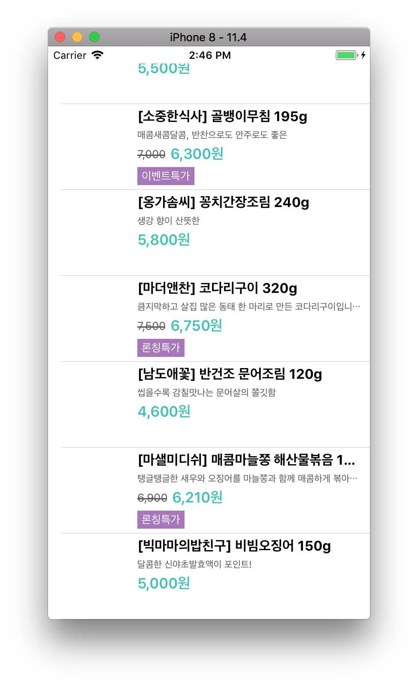
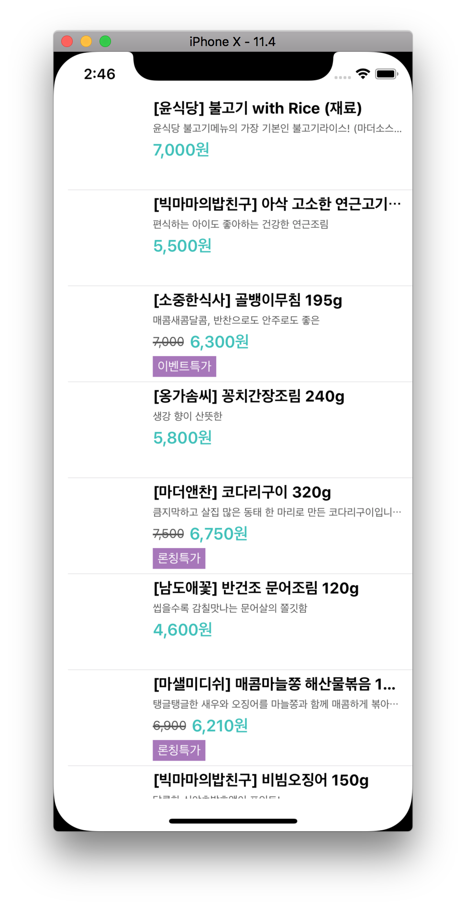
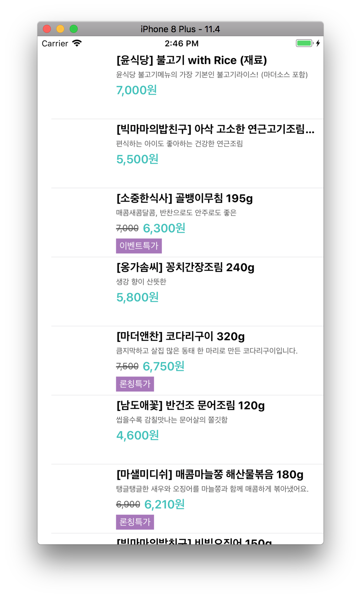
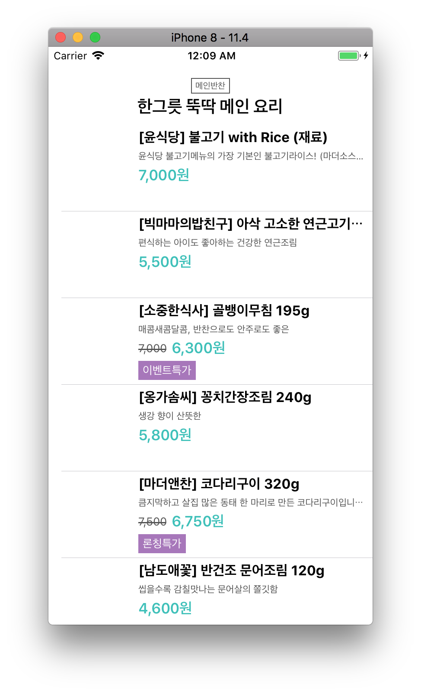

# Step. 1
- 완성날짜: 2018년 8월 13일

- Keyword
	- Custom TableViewCell class, JSONDecoder, Decodable, UIStackView

# Step. 2
- 완성날짜: 2018년 8월 14일

 
 
 

- Keyword
	- 서로 다른 화면 크기에 대응할 수 있는 오토레이아웃 적용하기

# Step. 3
- 완성날짜: 2018년 8월 16일

- Keyword
	- Custom Section Header, HeaderFooterView, Protocol inheritance, UITableView Delegate methods, UITableView DataSource methods, Enum CaseIterable Protocol

- 주요 작업사항
	- 기존 `JSONParser`객체를 `DataManager`객체로 바꾸면서 역할과 이름을 개선하였습니다.
	- 상위모듈에서 `StoreItemList`객체를 사용할 때 인터페이스를 단순화하였습니다.(init할 때 데이터 load, 실패가능한 이니셜라이저 활용)
	- 하나의 섹션에 대한 정보를 갖고 있는 StoreItemList가 StoreItem 배열뿐만 아니라 섹션에 대한 정보(title, description)를 갖습니다.
	- main, soup, side의 객체를 FoodCategory로 표현합니다.
	- 각 FoodCaterory의 정보를 배열로 갖고 있는 `SectionInfo` 상위 모델을 구현(섹션의 index접근을 위한 SectionInfo의 데이터 자료구조 선택: 배열)
	- 뷰컨트롤러가 셀이나 헤더뷰의 속성을 설정하기 위한 메서드에 인자로 모델전부를 넘겨주던 부분을 필요한 부분을 프로토콜로 넘겨주도록 개선하였습니다.
	- 테이블뷰 섹션의 Custom Header를 커스텀할 때 이전 단계에 사용하던 `BadgeLabel`을 재사용하였습니다.
	