# swift - storeapp

# Step1
> 커스텀 셀 구현, JSONDecoder 사용

### 작업
1. 커스텀 셀 구현
2. JSONDecoder 사용하여 json 파일을 파싱하였습니다.
3. StackView 를 구현하여 price 와 badge 유무에 따른 display 여부를 결정하였습니다.
4. (재사용을 위한) Custom StackView 적용 : Price, Badge
5. Attributable Protocol 적용 : Basic, Price, Badge Attributes 
6. Decorating Protocol 적용 : StoreItemCell, PriceView, BadgeView

### 첨부파일
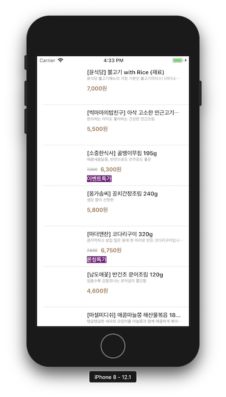

# Step2
> 오토레이아웃 적용

### 작업
1. 오토레이아웃 적용
2. Step1 에서 마무리 못한 관리부분 수정 : 각 스택뷰 안에 있는 라벨들은 스택뷰에서 관리하도록 변경 (Xcode 버그인 것인지 이전 단계에서 드래그 허용(?)이 되지 않아 cell 에서 addSubview 하도록 했었는데 역으로 스택뷰에서 객체 만들고 스토리보드로 드래그해서 매칭시켰습니다.) 

### 작업 중 문제점
 - TableViewController 가 아닌 ViewController 에 Delegate & Datasource 를 따르려고 했기 때문에 컨트롤러 안에 따로 추가했던 테이블뷰의 레이아웃이 넘어가는 문제때문에 원하던 결과가 나오지 않게 되었습니다.
 - 이를 수정하기 위해 테이블뷰 역시 오토레이아웃 적용을 하여 고정을 시키고 하위 뷰들의 오토레이아웃을 적용 시켰습니다.
 
 ### 첨부파일
 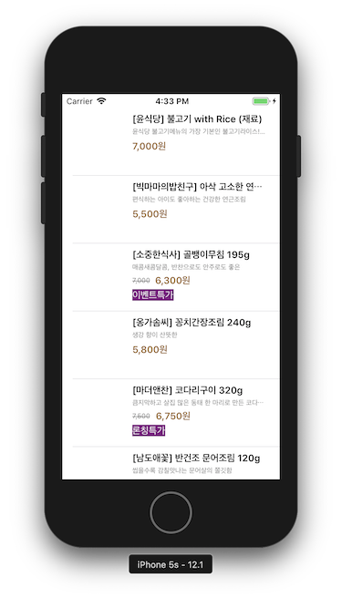 
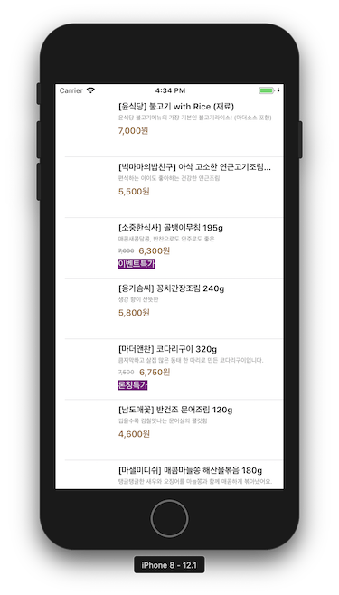
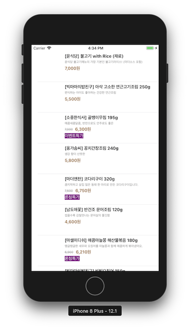
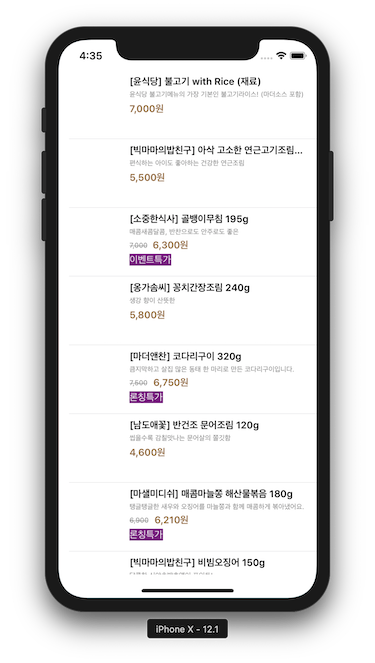
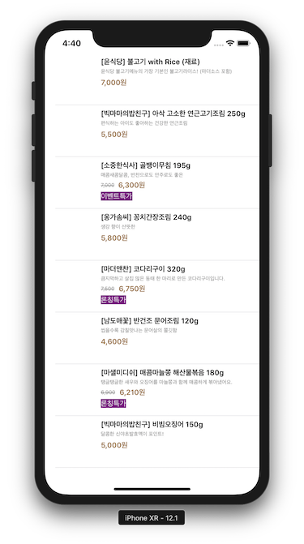
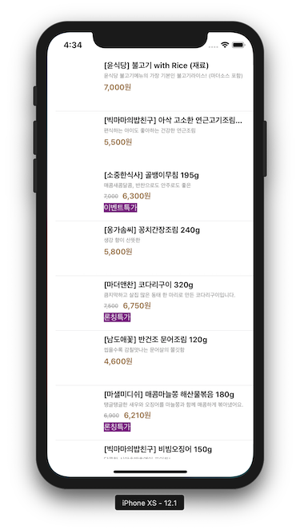
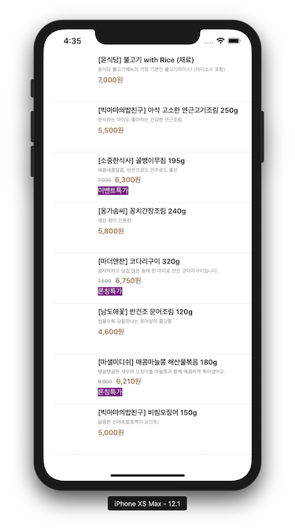

# Step3
> 커스텀 헤더 적용

### 작업
1. 커스텀 헤더 적용
    - StoreHeaderCell
    - Topic Model
2. 오토레이아웃 추가 적용
    - Horizontally in Container : Custom Header 의 중앙정렬
    - 최소 width 적용 : 스토리보드 안에서 >= value 설정하여 최소값 적용

### 첨부파일
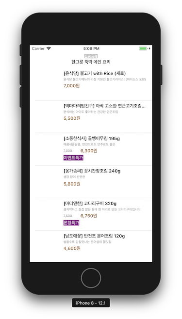 
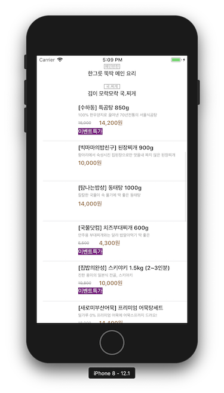 
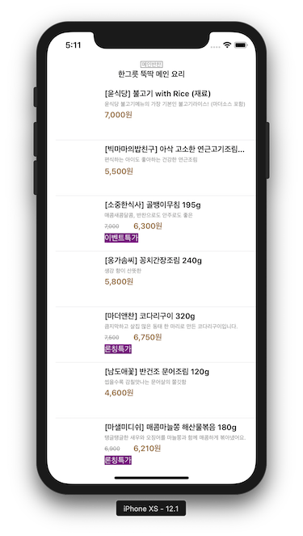 
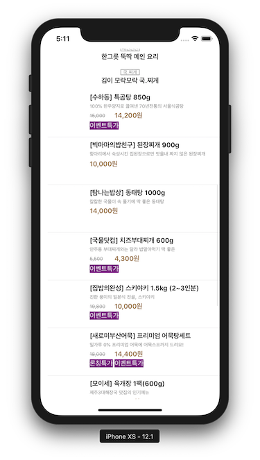 

# Step4
> Toaster 적용

### 작업
- Toaster 적용
- commit 에는 포함되어 있지 않지만 4.0 버전 기준으로 Toast 파일의 NotificationCenter AddObserver 의 이름을 수정하였습니다.

### 첨부파일
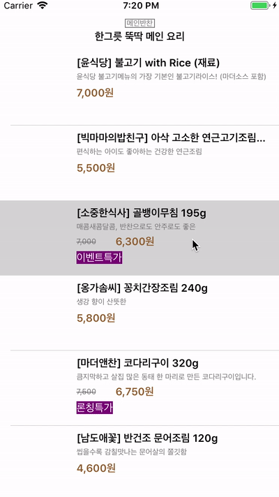

# Step5
> URLSession 사용

### 작업
1. 기존 내장 json파일이 아닌 URLSession으로 데이터를 받아오도록 변경하였습니다.
2. 데이터가 변경되면 Notification 사용해서 데이터를 테이블뷰에서 다시 리로드하도록 하였습니다.
3. 데이터를 제대로 받지 못하는 경우에는 alert을 띄워서 사용자에게 알릴 수 있도록 하였습니다.
4. `App Transport Security Settings` for HTTP

### 첨부파일
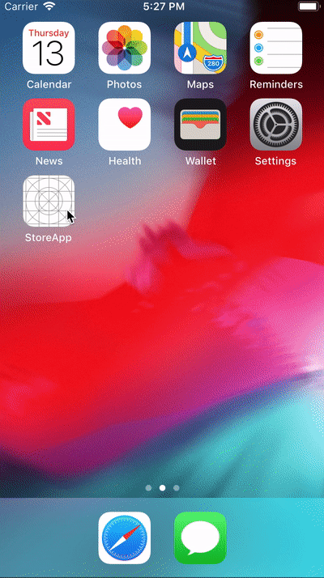
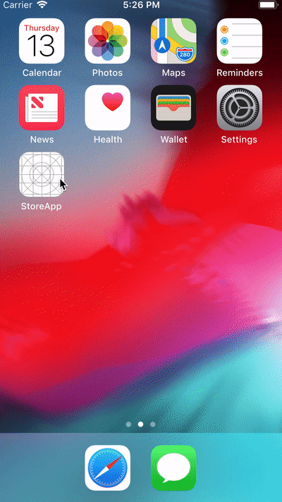

# Step6
> 이미지 병렬처리

### 작업
1. 이미지 병렬처리를 위해 아래와 같은 로직으로 작성하였습니다.
```
1. json 데이터 다운로드 이후에 작업 진행
    1) storeItemGroup 데이터 변경되면 -> self.tableView.reloadData
    2) 이미지 다운로드 -> 완료되면 각 셀 단위별로 self.tableView.reloadRows
2. UITableViewCell 나타낼 때 이미지는 이미지 파일명 기준으로 앱 디렉토리 안에 Cache 디렉토리에서 찾아서 있으면 이미지를 세팅하고 없으면 무시합니다.   
```
2. 카멜케이스 네이밍 방식을 위해서 `CodingKeys` 사용

### 첨부파일


# Step7
> 상품 상세화면 전환

### 작업
1. 상세화면 모델과 컨트톨러, 뷰 생성
2. 상단 페이지 스크롤 이미지와 하단 상세화면 이미지들을 비동기로 가져오도록 처리
3. 주문하기 관련 작업
    - 델리게이트 프로토콜 (Orderable) 추가
    - 주문하는 작업(슬랙 연동) 추가
4. 네트워크 매니저 객체 분리
5. 상세화면 구조를 아래와 같이 구성
6. 주문성공 or 실패 Alert 띄워 사용자에게 알리기
```
View
    ScrollView
        StackView 
            ScrollView  -> Thumbnail Image (Page Scroll)
            View        -> Info (Price, title etc)
            StackView   -> Detail Section (Image)
            
추가 적용
1. ScrollView 아래 StackView에 옵션 적용 - Distribution Option : Equal Spacing
2. 마지막 StackView 에 ImageView 추가할 때 줄어든 이미지의 넓이만큼 높이도 같은 비율로 줄이는 코드 추가
```

### 몰랐던 내용
 - 스크롤뷰에 아무것도 추가하지 않아도 기본으로 두개의 subview가 존재하는데 이것은 상하, 좌우 스크롤을 위한 스크롤바 입니다.
때문에 Page Scroll 을 구현하기 위해 x 값을 정하는데 계속 추가하지 않는 두개의 서브뷰가 존재해서 혼란스러웠습니다.

### 시간 걸렸던 작업
> 화면 구성 관련한 작업이 오래 걸렸습니다. 아래 구조들은 요구사항 적용에 실패 혹은 잘 하지 못했던 사례입니다.
```
1. 첫번째 방법 : 화면 전체가 스크롤되지 않고 각 스크롤뷰 안에서만 스크롤이 되었습니다.
View
    ScrollView
    View
    ScrollView

2. 두번째 방법 : StackView 이미지들의 사이즈가 원하는 방법대로 화면에 적용되지 않았습니다.
ScrollView
    ScrollView
    View
    StackView 
```

### 참고
 - [UIScrollView 안에서 UIStackView 사용하기 – Jongwon Woo – Medium](https://medium.com/@jongwonwoo/uiscrollview-%EC%95%88%EC%97%90%EC%84%9C-uistackview-%EC%82%AC%EC%9A%A9%ED%95%98%EA%B8%B0-738a77355a8)
 - [ios - Is it possible for UIStackView to scroll? - Stack Overflow](https://stackoverflow.com/questions/31668970/is-it-possible-for-uistackview-to-scroll)
