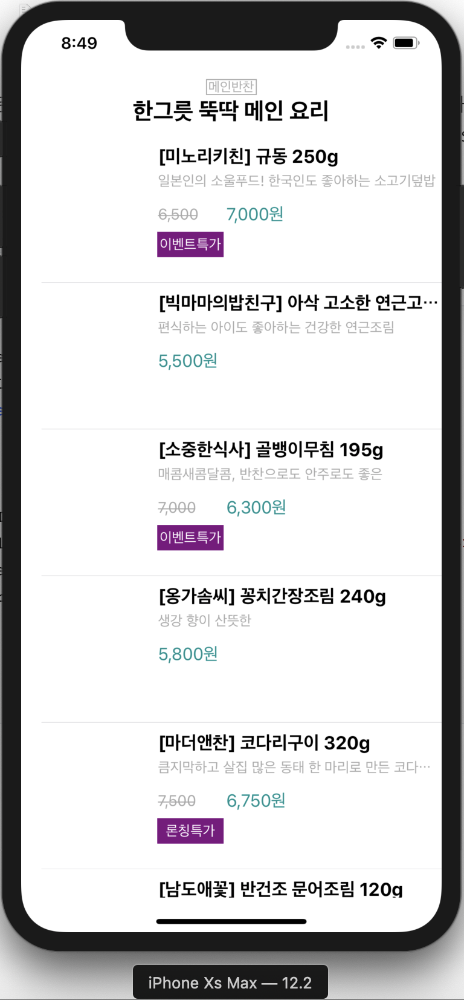

## StoreApp


### Step 1


* JSON Parsing 에 **JSONDecoder** 활용하기
* Text Customizing 하기


**JSONDecoder 활용**

 활용하기 앞서 두 가지의 프로토콜이 존재한다. 이 두가지 프로토콜을 채택하게 되면 그 타입은 밑의 설명과 같이 사용이 가능해진다.

* `Decodable` : 자신을 외부표현에서 디코딩 가능한 타입으로 바꿀 수 있음
* `Encodable` : 자신을 외부표현으로 인코딩할 수 있는 타입으로 바꿀 수 있음
* `Codable` : 자신을 외부표현으로 인코딩 외부표현에서 디코딩이 전부 가능해짐

 우선 이번스텝에서는 `Decodable` 을 채택하고 `JSONDecoder` 을 사용해 외부표현에서 디코딩하였다. 과정을 살펴보면 다음과 같다.

 내가 디코딩하고자 하는 타입에 `Decodable` 프로토콜을 채택해주어야 한다.

```swift
class StoreItem: Decodable {
    private var detail_hash: String
    private var image: String
    private var alt: String
    private var delivery_type: [String]
    private var title: String
    private var description: String
    private var n_price: String?
    private var s_price: String
    private var badge: [String]?
}
```

`StoreItem` 타입으로 디코딩할 준비가 끝났다. 다음은 Decoding을 해줄 JSONDecoder 객체를 생성하여야한다.

```swift
let decoder = JSONDecoder()
guard let data = jsonData.data(using: .utf8) else { return }
// jsonData는 json형식의 String으로된 데이터를 Data타입으로 반환하는 과정
decoder.decode(StoreItem.self, from: data)
// 이렇게 하면 완료된다.
```


**UILabel Text Customizing**

 String을 Customizing하기 위해선 `NSAttributedString` 타입을 사용한다. Objective-c의 타입이다. 우선 Label의 text를 Customizing하기 위해서 `UILabel`의 `attributedText` 프로퍼티를 활용했다.

 다양한 모양으로 텍스트를 꾸밀 수 있었는데 이번 스텝에서는 글자 중간에 줄을 긋는 것만을 사용하였다.

```swift
let label: UILabel = UILabel()
label.attributedText = NSAttributedString(string: text, attributes: [.strikethroughStyle: NSUnderlineStyle.single.rawValue])
// attributes: 부분에 [NSAttributedString.Key: Any]? 타입이 들어가는데
// .Key 부분에는 스타일을 지정할 수 있는 타입이 들어간다. Any 부분에는 저 값을 통해서 정도를 
//  Any 부분에는 저 값을 통해서 정도를 조절할 수 있다.
```


### Step 2


*  AutoLayout이 CustomCell 에서 적용되지 않음


**Custom Cell AutoLayout 적용**

 처음 작업할 때, MainStoryboard에서 Constraint를 적용해주었다. 그런데 예상과 다르게 실행하였을 때 레이아웃이 적용이 되지않았다.

 Cell을 TableView에 만들고 Custom으로 적용해줄 때 Custom Class를 등록해준다. 그 때 Content View의 Custom Class도 함께 설정이 되어진다.


 여기서 Content View를 선택 후, Custom Class를 UIView로 바꿔주어야 한다. Custom Class로 지정되어있을 시, Interface Builder에서 인식을 하지 못하는 듯했다.


**실행화면**

 


### Step 3


* TableView Section Header를 ProtoType Cell을 이용하여 Custom하기
* 프로젝트 Bundle에서 파일 가져오기


**TableView Section Header Custom 하기**

 Custom Cell을 이용하여 Header를 만들기 때문에, 이전에 TableView에서 Cell을 만들어주었던 것과 동일하게 StoryBoard에서 TableView에 Cell을 하나 생성해준다. 그 후 Custom Cell을 만들어주었던 것과 동일하게 Custom Class를 만들어주고 연결시켜준다.

 그럼 이 Custom Cell을 `TableViewDataSource` 에서 생성해주는 것이 아닌 `TableViewDelegate` `func tableView(_ tableView: UITableView, viewForHeaderInSection section: Int) -> UIView?` 메소드를 활용하여 생성해줄 것이다.

```swift
// Section Header에 사용 될 테이블 뷰 셀
class StoreHeaderCell: UITableViewCell {
  @IBOutlet weak var themeLabel: UILabel!
  @IBOutlet weak var descriptionLabel: UILabel!
}

// Delegate를 구현한 클래스
class StoreAppDelegate: NSObject ,UITableViewDelegate {
  func tableView(_ tableView: UITableView, viewForHeaderInSection section: Int) -> UIView? {
    guard let cell = tableView.dequeueReusableCell(withIdentifier: 			StoreHeaderCell.identifier) as? StoreHeaderCell else { return UITableViewCell() }
    cell.set(at: section)
    return cell
  }
}
```


**프로젝트 번들에 접근해서 파일 가져오기** (IOS 샌드박스 구조 공부 필요)

 IOS에서는 Mac과 폴더가 이뤄진 구조가 다르기 때문에, 절대경로를 사용할 수 없다. 이를 위해 상대경로가 필요하다. 여기서 문제를 해결할 때, 처음에 절대경로를 이용해서 피드백을 받았다. 이후 Bundle에 대해알아보고 사용법을 익혀 사용해보았다.

 우선 `Bundle` 이란? 앱의 정보와 자료를 하나의 공간에 그룹화해서 저장한 디렉토리이다.

 번들을 사용하기 위해 Swift의 `Bundle` 클래스를 이용하였다. `Bundle` 클래스의 자세한 사용법은 공식문서를 읽어보면 될 것 같다. StoreApp에선 Bundle안의 Json 파일의 경로를 읽어오기 위해 `path`  메소드를 사용하였다.


1. 프로젝트 번들에 파일이나 이미지를 추가하기 위해 Xcode Project폴더를 들어가야한다.


2. 선택 후 오른쪽 화면에 Target을 현재 프로젝트로 선택 후, `Build Phase` 항목 중 `Copy Bundle Resources` 항목을 선택하여준다.


3. 여기서 `+` 버튼을 눌러 원하는 파일을 추가하여 준다.


 이렇게 해주면 이제 Bundle에 파일을 준비했고 사용할 준비가 모두 끝났다. 이제부터 `Bundle` 클래스를 사용해 Path를 읽어오고 파일에 접근해 내용을 읽어오면 된다.

```swift
static func searchPathFromBundle(of file: String) -> String? {
  // 파일 이름을 매개변수로 받아와 확장자와 파일이름으로 나누어 구분하였다.
  let fileNameAndExtension = file.split(separator: ".").map { String.init($0) }
  guard fileNameAndExtension.count == 2 else { return nil }
  
  // path함수를 사용하면 main 번들 내에 forResource: 에 인자로 넣어준 파일이름을 가지고 ofType: 의 확장자를 가		 진 파일의 Path를 찾아준다. 
  return Bundle.main.path(forResource: fileNameAndExtension[0], ofType: fileNameAndExtension[1])
}
```


**실행화면**




## Step 4


* CocoaPod 이용하여 외부 라이브러리 다운받기


**CocoaPod**

 `CocoaPod이란?` 외부 라이브러리를 관리하기 쉽도록 도와주는 의존성 관리 도구이다. 애플 플랫폼에서 사용할 수 있는 도구인데 여러가지가 있다. 

 예) `CocoaPods`, `Carthage`, `Swift Package Manager`

 이번 스텝에서는 `CocoaPads`을 이용하여 `Toaster` 라이브러리를 다운받아 import하여 사용하였다. 지금부터 CocoaPod 다운부터 사용까지 알아볼것이다.


1. CocoaPods을 사용하기 앞서 Terminal Rudy를 이용하여 다운하여야 한다.

   `$sudo gem install cocoapods` 명령어를 터미널에 입력하여 다운한다.

2. 프로젝트에 CocoaPod을 다운받기위해 프로젝트 디렉토리로 이동한다. `$cd` 명령어를 이용한다.

3. 이동 후, 프로젝트 폴더에 PodFile을 다운받아준다.

   `$pod init` 명령어를 터미널에 입력한다.

4. `cocoapods.org` 홈페이지에서 필요한 라이브러리 파일을 찾는다.

5. `$pod init` 후에 생긴 podfile을 열어 `target do`, `end` 사이 다운받으려는 라이브러리를 입력한다.

6. Terminal에서 `$pod install` 명령어를 입력하여 원하는 라이브러리를 프로젝트에 다운받는다.


 이렇게하면 pod Library 다운이 모두 끝났다. 이후 파일을 열어 `import 라이브러리이름` 을 입력하여 사용하면 된다.


**CocoaPods** vs **Carthage**

 Swift의 의존성 관리도구에는 몇가지가 있다. 그 중 두 가지 도구의 차이점을 알아볼 것이다.


##### CocoaPods

 `CocoaPods`는 라이브러리를 관리해줄뿐만 아니라 일단 라이브러리를 프로젝트에 설치하게 되면, `.xcworkspace` 파일을 생성하고 프로젝트와 라이브러리의 프레임워크를 바로 자동으로 연결하게 된다.

 그로 인해, 나오는 장점과 단점이 생기게 된다.

장점

1. 모든 설정을 자동으로 해주기 때문에, 프레임워크를 직접 연결하여야 되는 번거로움이 없다.
2. `cocoapods.org` 사이트에서 라이브러리를 찾기 쉽다.

단점

1. 라이브러리를 인스톨하게 되면 소스를 모두 자동으로 받고 연결하기 때문에, 프로젝트 구성에 개발자가 권한이 존재하지 않는다.
2. 소스를 자동으로 모두 받고 컴파일 시 같이 빌드한다. 그렇기 때문에 소스의 양이 많을 시 컴파일 시간이 늘어나게 된다.
3. Ruby을 사용하기 때문에, Ruby 버전의 영향을 많이 받는다.

------

 ##### Carthage

 `Carthage` 는 라이브러리만을 관리하고 프로젝트와 연결은 개발자가 직접해주어야 한다. 그렇기 때문에, 또 `CocoaPods` 와는 다른 장,단점이 발생한다.

장점

1. `Carthage` 는 프로젝트의 설정을 침범하지 않는다. 단순히 라이브러리만 관리해준다. 그렇기 때문에 개발자에게 권한이 있다.

단점

1. 프로젝트의 설정을 침범하지 않기 때문에, 개발자가 라이브러리 사용을 위해 연결을 해주어야한다. 그렇기 때문에, 잘못 연결할 경우 문제가 발생한다.
2. 모든 연결은 개발자의 몫이기 때문에 번거롭다.


### Step 5


* URLSession을 이용하여 네트워크로부터 데이터를 받기
* 비동기 / 동기 처리방식


**URLSession 사용**

 기본적으로 `URLSession` 은 HTTP 통신과 같은 구조를 가진다. `Request` , `Response`  구조이다. 사용하기 위해 우선 `URLSession` 객체를 만들어 통신할 서버를 설정한다. 다음으로 `Response` 는 `URLSession` 의 `Task Completion Handler` 형태로 받거나 `URLSessionDelegate` 를 통해 지정된 메소드를 호출하는 형태로 Response를 받는다.

URLSession 세가지 타입

1. **Default Session**: 기존적인 Session. 디스크 기반 캐싱을 지원한다.
2. **Ephemeral Session**: 세션관련 데이터 메모리에 올가가 있다. 어떠한 데이터도 저장 X
3. **Background Session**: 앱 종료후에도 통신을 지원한다.

Session Task 세가지 타입

1. **Data Task**: Data 객체를 주고받는 Task
2. **Upload Task**: Server로 디스크로부터 Data를 Send하는 Task, Background Upload역시 지원한다.
3. **Download Task**: 서버로부터 파일을 다운로드하는 Task


1. 사용을 위해 우선 `URLSession` 객체를 생성
2. Server URL로 `URLRequest` 객체 생성
3. `DataTask` 생성 여기에 완료 Handler로 Response를 받고 할 행동을 지정
4. `DataTask.resume()` 으로 Task 실행, 여기서 실행하게 되면 Thread가 하나 더 생기게 된다.

```swift
struct NetworkHandler {
  static func getData(from urlType: ServerURL) {
    guard let url = URL(string: urlType.rawValue) else { return }
    let request = URLRequest(url: url)
    let session = URLSession(configuration: .default)

    let dataTask = session.dataTask(with: request) { data, response, error in
    	guard error == nil else { return }
     	guard let data = data, let response = response as? HTTPURLResponse, response.statusCode == 200 else { return }
      guard let parseData = JSONParser.parseJSONData(data) else { return }
      DispatchQueue.main.async {
      	switch urlType {
        case .main:
        	NotificationCenter.default.post(name: .getMain, object: nil, userInfo: ["main": parseData.body])
        case .soup:
          NotificationCenter.default.post(name: .getSoup, object: nil, userInfo: ["soup": parseData.body])
        case .side:
          NotificationCenter.default.post(name: .getSide, object: nil, userInfo: ["side": parseData.body])
        }
      }
    }
    dataTask.resume()
  }
}

```

 여기서 Resume()으로 Task를 실행하게 되면 Thread가 하나 더 생겨서 실행되게 된다. 여기서 만약 핸들러에 UI를 조작하는 코드가 있을 시 문제가 발생한다.

 비동기 방식이기 때문에 UI를 여러개가 건드리게 된다. UI는 항상 main Thread에서만 Update되어야 한다. 이를 해결하기 위해 비동기 처리 **GCD**을 이용할 것이다.


**GCD 비동기 처리**

 `Dispatch Queue`을 사용하면 비동기식/동기식으로 임의의 코드블록을 수행할 수 있다. 기본적으로 Queue이기 때문에 `FIFO` 방식이다. 앱에서 사용가능한 여러가지 타입이 있다.

1. **Serial Queue**: 큐에 추가된 순서대로 하번에 하나의 Task를 수행한다. 필요한 만큼 Queue 생성이 가능하다. 단 하	드웨어의 성능에 맞추어야 한다. 예를 들어 4개를 생성시 한 큐는 하나의 Task만 수행하지만 동시에 4개의 			Task가 실행된다.
2. **Concurrent Queue**:  큐에 Task가 추가된 순서대로 계속 실행된다.
3. **Main Dispatch Queue**: 전역적으로 사용 가능한 Serial Queue이다. 이 큐는 앱의 실행루프와 함께 작동하여 큐에 있는    Task의 실행을 실행루프에 연결된 다른 이벤트 소스의 실행과 얽힌다. 즉 Main Thread


**NetWork로 데이터를 불러와 TableView에 업데이트를 하는 도중 생긴 문제**


 다음과 같은 에러가 뜨면서 앱이 종료되었다. 즉 Section안의 Row가 아직 생성되지 않았는데 데이터를 넣을려고 하고 있는 문제이다. 즉 데이터를 받아오면 그에 맞게 Section의 로우를 생성해주어야 한다.

 그리고 여기서 네트워크를 통해 병렬적으로 데이터를 받아올 때 문제가 발생한다. 병렬적으로 받아올 때, 받아오는 대로 `insertRows(at: indexPaths, with: .automatic)` 를 실행하게 되면, `TableViewDataSource` 의 메소드를 다시 전부 호출하게 되는데 이 때 다른 Section의 모델이 업데이트 되어버리면 위와 같이 아직 Section에 Row가 만들어지지 않았는데 넣기 때문에 위와 같은 에러가 발생한다.

 이를 해결하기 위해, 네트워크로 데이터를 받아오는 것은 병렬로 진행을 하지만 받아온 데이터를 모델에 Set하고 `TableView` 의 Row에 Insertion하는 과정은 `Serial` 하게 진행되도록 하였다. 즉, 한 모델에 데이터가 Set되고 `TableView` Insertion을 하는 동안은 다른 Model의 Set이 진행될 수 없도록 고쳐주었다.


**실행화면**

