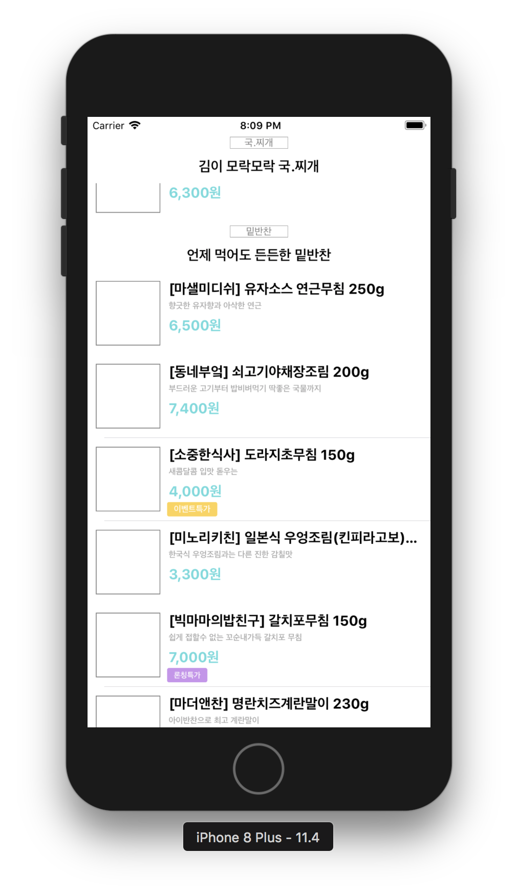

# 스토어 앱

## 완성화면

### Step1 (2018.07.09)


### Step2 (2018.07.10)
- 오토레이아웃 적용
- 

### Step3 (2018.07.12)
- 커스텀 헤더 적용
- 

### Step4 (2018.07.12)
- Toaster 라이브러리 사용
- 

### Step5 (2018.07.23)
- Network 프로그래밍
- `insertRows()`, `URLSession.shared.dataTask`
- 

### Step6 (2018.07.26)
- 이미지 다운로드 병렬처리
- `URLSession.shared.downloadTask`, `FileManager`
- 
- 상품 이미지를 로드할 수 없을 때 refresh 이미지 표시
- 

### Step7 (2018.08.02)
- 상품 상세화면 전환
- 스크롤뷰 구현
- 주문기능 구현
  - Slack으로(Slack incoming hook) “누가-얼마짜리-메뉴” 주문을 POST 요청으로 보내는 기능을 구현
-    

## 어려웠던 부분
### 1. 데드락(Deadlock)
- 문제 코드   
```swift
// TableViewCell.swift

  private func setItemImage(imageURL: String) {
    // 1. ImageSetter의 download()호출
    ImageSetter.download(with: imageURL, handler: { imageData in
      // 3. download()함수가 종료되면서 핸들러가실행됨. 같은 main queue라서 문제발생  
      DispatchQueue.main.sync { [weak self] in
        guard let data = imageData else { return }
        self?.itemImage.image = UIImage(data: data)
      }
    })
  }
```

```swift
// TableViewCell에서 ImageSetter의 download가 호출

class func download(with url: String, handler: @escaping((Data) -> Void)) {
    let cacheURL = fileManager.urls(for: .cachesDirectory, in: .userDomainMask).first!
    let imageSavingPath = cacheURL.appendingPathComponent(URL(string: url)!.lastPathComponent)

    // 2. 아래 줄 코드의 existFile이 체크되고 handler가 실행됨
    if let imageData = existFile(at: imageSavingPath) {
        handler(imageData)
    } else {
        URLSession.shared.downloadTask(with: URL(string: url)!) { (tmpLocation, response, error) in
          // do something...
        }.resume()
    }
}
```

- 컴플리션 핸들러를 처리하는 코드에서 데드락 상황 발견
  - main queue에서 또 main.sync로 돌아가는 코드블럭을 호출
  - setItemImage() 함수는 ImageSetter의 download()를 호출하며, 인자로 url과 함께 컴플리션 핸들러를 넘긴다. (main queue에서 실행)
  - 해당 컴플리션 핸들러의 코드 블럭을 편의상 `A블럭`이라고 칭한다.
  - 이때 `A블럭`의 관련 worker는 다음과 같다.
    - `Assignor : setItemImage()`, `Assignee : download()`
  - download()는 함수를 빠져나오는 시점에 `A블럭`을 실행한다.
  - 이때의 `A블럭`의 worker는
    - `Assignor : download()`, `Assignee : setItemImage()`
  - 두 worker가 모두 main queue에서 sync로 동작하기때문에, 서로가 교차하여 서로를 가리키고있고 서로 일이 끝나기만을 기다리는 데드락 상황이 발생.
  - **handler의 코드를 async로 변경하여 문제를 해결할 수 있다.**
