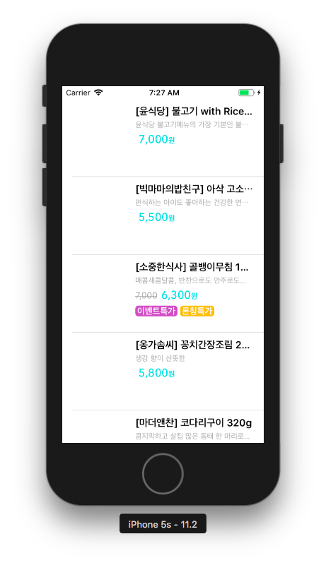
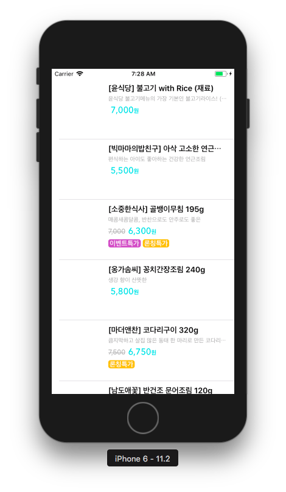
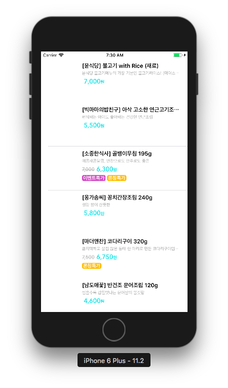
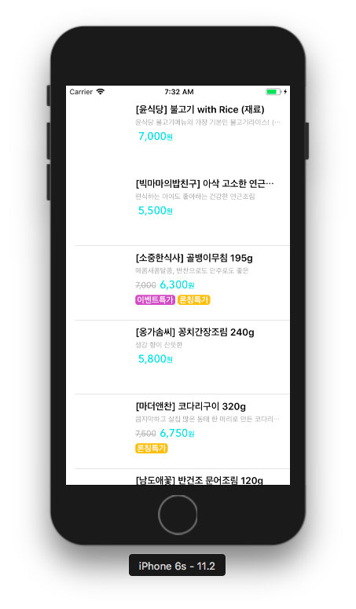
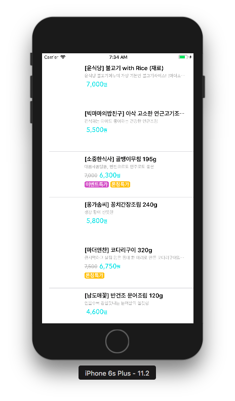
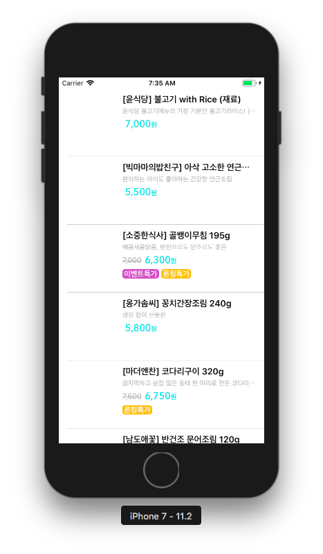
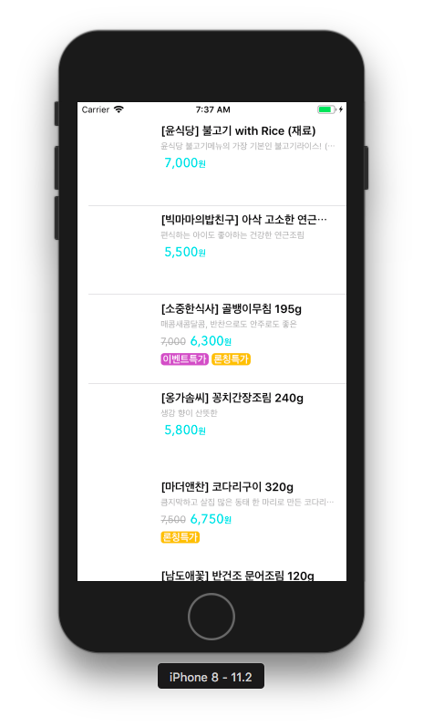
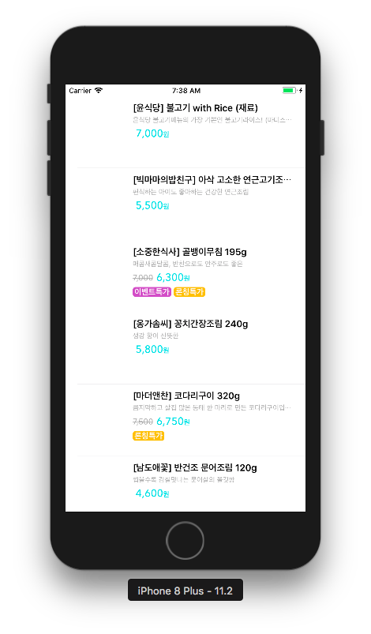
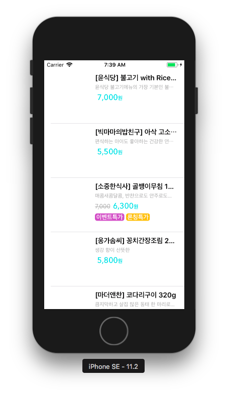
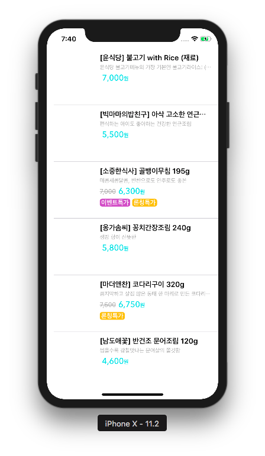

# 쇼핑 앱

## 테이블 커스텀 셀 구현
- 썸네일은 아직 표시 안 함.


### 프로토타입 셀 구성
- IB > Style : Custom
- IB > Identifier : ListCell


### 커스텀 뷰 클래스
- IB와 연결
	- IB > Custom Class > Class : ItemCell

```swift
class ItemCell: UITableViewCell {
    @IBOutlet weak var thumbnail: UIImageView!              // 썸네일
    @IBOutlet weak var title: UILabel!                      // 제목
    @IBOutlet weak var titleDescription: UILabel!           // 설명
    @IBOutlet weak var pricesContainer: PricesContainer!    // 정가, 할인가
    @IBOutlet weak var badges: BadgesContainer?             // 뱃지들
}
```

### 모델 클래스
#### 구조

```swift
struct StoreItem {
    let detailHash: String
    let image: String
    let alt: String
    let deliveryTypes: [String]
    let title: String
    let description: String
    let salePrice: String
    let normalPrice: String?
    let badges: [String]?
}
```

#### JSON 파싱을 위해 Decodable 채택
- json 데이터를 모델 클래스로 파싱 가능.
- 이 때, json 데이터의 key와 coding key 이름이 다른 경우, rawData로 추가.

```swift
extension StoreItem: Decodable {
    enum CodingKeys: String, CodingKey {
        case detailHash = "detail_hash"
        case image
        case alt
        case deliveryTypes = "delivery_type"
        case title
        case description
        case salePrice = "s_price"
        case normalPrice = "n_price"
        case badges = "badge"
    }

    init(from decoder: Decoder) throws {
        let values = try decoder.container(keyedBy: CodingKeys.self)
        self.detailHash = try values.decode(String.self, forKey: .detailHash)
        self.image = try values.decode(String.self, forKey: .image)
        self.alt = try values.decode(String.self, forKey: .alt)
        self.deliveryTypes = try values.decode([String].self, forKey: .deliveryTypes)
        self.title = try values.decode(String.self, forKey: .title)
        self.description = try values.decode(String.self, forKey: .description)
        self.salePrice = try values.decode(String.self, forKey: .salePrice)
        self.normalPrice = try? values.decode(String.self, forKey: .normalPrice)
        self.badges = try? values.decode([String].self, forKey: .badges)
    }
}
```

#### JSON 파싱 위한 헬퍼 메소드
- getDataFromJSONFile: json 파일을 불러와 Data 타입으로 변환.
- decode: Data 를 특정 객체의 배열로 디코딩하여 반환.

```swift
static func decode<T: Decodable>(data: Data?, toType type: [T].Type) -> [T] {
    guard let data = data else { return [] }
    let decoder = JSONDecoder()
    var decodedData: [T] = [T]()
    do {
        decodedData = try decoder.decode(type, from: data)
    } catch {
        NSLog(error.localizedDescription)
    }
    return decodedData
}

static func getDataFromJSONFile(_ fileName: String) -> Data? {
    guard let path = Bundle.main.path(forResource: fileName, ofType: "json") else { return nil }
    let url = URL(fileURLWithPath: path)
    var data: Data?
    do {
        data = try Data(contentsOf: url)
    } catch {
        NSLog(error.localizedDescription)
    }
    return data
}
```

### 뷰컨트롤러
#### JSON 파싱 및 모델 객체 생성

```swift
class ViewController: UIViewController, UITableViewDataSource {

    @IBOutlet weak var tableView: UITableView!
    private var items = [StoreItem]()

    override func viewDidLoad() {
        super.viewDidLoad()
        tableView.dataSource = self
        let data = JSONParser.getDataFromJSONFile("main")
        self.items = JSONParser.decode(data: data, toType: [StoreItem].self)
    }
    ...
}
```

#### 뷰에 모델 삽입
- **[Required]** 시스템이 (특정 테이블의) 셀을 그릴 수 있도록 셀에 데이터를 삽입하여 전달.

```swift
func tableView(_ tableView: UITableView, cellForRowAt indexPath: IndexPath) -> UITableViewCell {
	// 현재 셀의 데이터(모델)
    let currentRowData: StoreItem = self.items[indexPath.row]
    // 현재 셀(뷰)
    guard let cell = tableView.dequeueReusableCell(withIdentifier: "ListCell") as? ItemCell else {
        return UITableViewCell()
    }
    // 각 셀에 데이터 삽입
    cell.title.text = currentRowData.title
    cell.titleDescription.text = currentRowData.description
    cell.pricesContainer.normalPrice?.attributedText = currentRowData.normalPrice?.strike
    cell.pricesContainer.salePrice.attributedText = currentRowData.salePrice.salesHighlight
    cell.badges?.appendItems(with: currentRowData.badges)
    return cell
}
```

#### 그 외 테이블 설정
- **[Required]** 테이블 섹션 하나 당 행 개수: 모델 개수와 동일하게 제공.

```swift
func tableView(_ tableView: UITableView, numberOfRowsInSection section: Int) -> Int {
    return self.items.count
}

```

- 데이터에 따라 자동으로 높이를 설정할 수 있도록 설정. 
- UITableViewAutomaticDimension은 오토레이아웃 제약을 줘야 작동함. 
- 그 전에 임시로 estimatedRowHeight를 준다.

```swift
override func viewWillAppear(_ animated: Bool) {
    self.tableView.estimatedRowHeight = 40
    self.tableView.rowHeight = UITableViewAutomaticDimension
}
```

### 뱃지 컨테이너를 위한 메소드
- 뱃지는 배열 데이터로, 몇 개가 들어올 지 모르며 가로로 차곡차곡 붙여야 함.
- 차곡차곡 붙이기 위해 Horizontal StackView를 사용.
- 하지만 오토레이아웃 적용을 위해 StackView의 너비가 이미 고정돼 있는 상황.
- 이를 해결하기 위해 추가되는 arrangedSubview들의 IntrinsicContentSize를 합하여 StackView의 너비를 동적으로 변경.

```swift
func resizeContainer() {
    var contentWidth: CGFloat = 0.0
    var contentHeight: CGFloat = 0.0
    self.arrangedSubviews.forEach {
    	 // 콘텐츠들의 IntrinsicContentSize를 사용.
        $0.invalidateIntrinsicContentSize()
        contentWidth += $0.intrinsicContentSize.width + self.spacing
        contentHeight = $0.intrinsicContentSize.height
    }
    // 기존에 적용한 오토레이아웃 제약사항을 무효화.
    self.translatesAutoresizingMaskIntoConstraints = false
    // 가로, 세로 제약사항 추가.
    self.widthAnchor.constraint(equalToConstant: contentWidth).isActive = true
    self.heightAnchor.constraint(equalToConstant: contentHeight).isActive = true
}
```

## 오토레이아웃 적용
</img></img></img>
</img></img></img>
</img></img></img>
</img></img>
### 뱃지 추가 방법 수정
#### 뱃지 컨테이너 제약조건 변경
- 기존: 컨테이너에 뱃지를 하나씩 붙이면서 컨테이너 크기를 늘려나감.
- 제약조건을 수정하면서 기존 resizeContainer() 메소드 제거.
- **widthAnchor, heightAnchor priority: 1000(required) → 750**
	- 고정이 아닌 가변성을 띄게 됨.
- **trailing margin: <= 20** 
	- 아무리 너비가 늘어나더라도 가장 오른쪽에서 20만큼은 남겨둠.
- **Content Hugging Priority (Horizontal): 250 → 751**
	- 뱃지들의 콘텐츠 사이즈를 유지하고, 늘어나는 데 저항성 높임.
- **Content Compression Resistance Priority (Horizontal): 750 → 751**
	- 뱃지들의 콘텐츠 사이즈를 유지하고, 줄어드는 데 저항성 높임.

#### 뱃지가 중복되어 추가되는 문제 수정
- 문제점: 테이블뷰를 스크롤 시, 뱃지가 중복되어 추가됨.
- 원인: **커스텀 셀을 재사용하기 때문**.
- 해결방법: 커스텀 셀 클래스에서 **prepareForReuse()** 메소드를 오버라이드 하고, 뱃지 컨테이너의 서브뷰들을 초기화
	- 이 때, 단순히 서브뷰를 떼어내기만 하면 다른 곳에 뱃지가 추가되는 문제가 생김.
	- 반드시 **서브뷰의 설정돼 있던 데이터도 초기화**해줘야 한다.