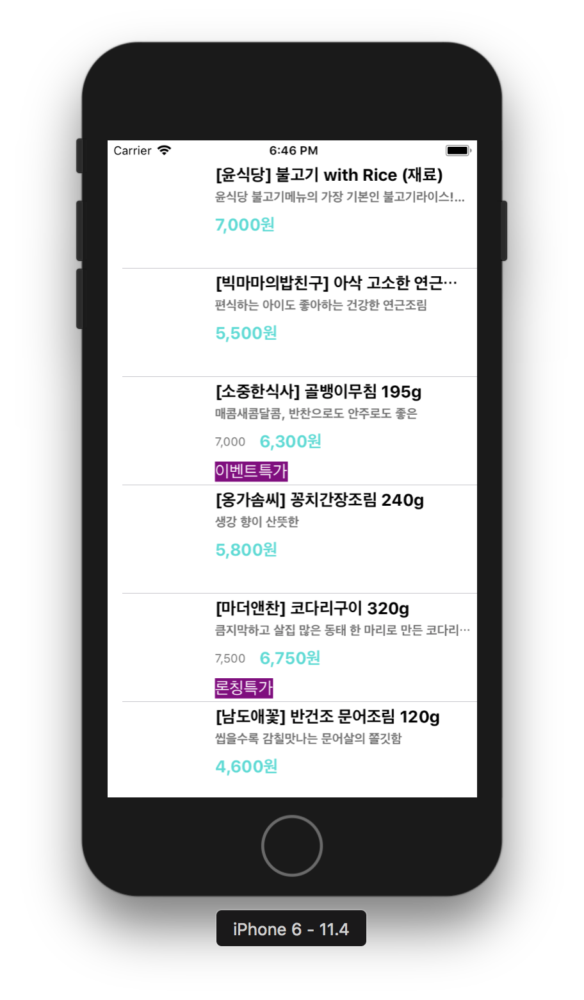

## step 1

### 프로그래밍 요구사항
* 스토리보드 ViewController에 TableView를 추가하고 Safe 영역에 가득 채우도록 frame을 설정한다.
* 테이블뷰에 새로운 프로토타입 Cell을 추가하고, Custom 스타일로 지정하고 다음과 같이 디자인한다.
* main.json 데이터 경로 => `http://public.codesquad.kr/jk/storeapp/main.json`

* 위 파일을 다운로드해서 프로젝트에 복사하고 JSONDecoder를 활용해서 내부에 Array<StoreItem> 타입으로 변환하는 DataSource에서 사용할 모델 객체를 만든다.

	* subscript로 배열에 index로 접근하면 StoreItem 구조체를 반환한다.
	* StoreItem은 Decodable 프로토콜을 채택하고, main.json에 있는 키와 값을 매핑해서 속성으로 갖도록 구현한다.
* UITableViewDataSource 프로토콜 구현 부분에서 cell을 위에서 만든 DataSource 모델 객체에 접근해서 테이블뷰를 표시한다.

	* 이미지뷰에 image는 아직 표시하지 않는다.

### 학습꺼리
* Swift 객체에 대한 Encoding & Decoding 방식에 대해 학습한다. [공식 자료](https://developer.apple.com/documentation/foundation/archives_and_serialization/encoding_and_decoding_custom_types)

## step2

### 프로그래밍 요구사항
* 스토리보드 ViewController에 Cell을 Content View를 기준으로 하위 뷰들에 오토레이아웃을 적용한다.
	* 메뉴 이미지 뷰는 top, bottom, lead 제약을 주고 width 제약을 넣는다. height와 width 비율은 1:1로 aspectRatio를 맞춘다.
	* 타이틀 제목은 메뉴 이미지보다 10pt 우측에 lead 제약을 주고, top, tail 제약을 주고, height 제약을 준다.
	* 상세 설명도 top 제약만 타이틀 제목보다 4pt 띄우고, 나머지는 타이틀에 맞춘다.
	* 메뉴 가격도 width 제약을 넣고, 나머지는 타이틀과 마찬가지로 제약을 준다.
	* 이벤트 배지는 최소width 제약만 주고 글자 내용에 맞추고, 없을 경우 감춘다.

### 목표 실행 화면
* 모든 아이폰 사이즈에 대응해서 잘리는 화면이 없이 나와야 한다.

### 학습꺼리
[오토레이아웃 강의 자료](http://public.codesquad.kr/jk/storeapp-layout-slide.pdf)
